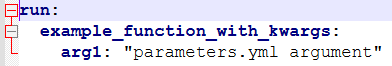
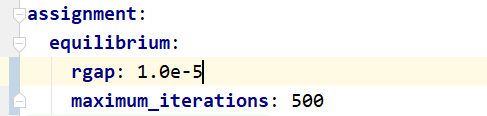
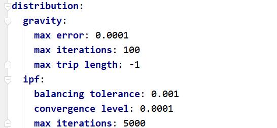
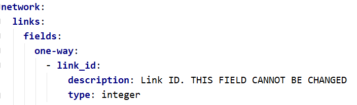
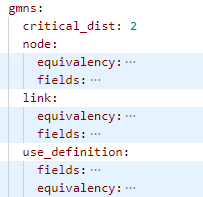
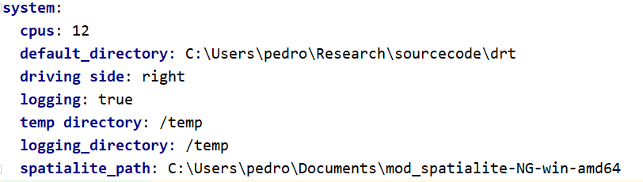

.. _parameters_file:

Parameters YAML File
====================

The parameter file holds the parameters information for a certain portion of the software.

.. _parameters_run:

Run
---

The run section of the parameter file defines the default keyword arguments for the callable objects
in the :ref:`run_module`. Each subsection names a callable symbol within the ``run/__init__.py``
module, if the symbol does not exist a ``RuntimeError`` will be raised when ``project.run`` is
accessed. The arguments are applied via ``functools.partial`` and replace the objects within the
module.

This can be used to define model entry points or functions that should be stored adjacent to the
model itself.

.. _parameters_assignment:

Assignment
----------

The assignment section of the parameter file is the smallest one, and it
contains only the convergence criteria for assignment in terms of the maximum number
of iterations and target Relative Gap.

Although these parameters are required to exist in the parameters file, one can
override them during the assignment, as detailed in :ref:`convergence_criteria`.

.. _parameters_distribution:

Distribution
------------

The distribution section of the parameter file is also fairly short, as it
contains only the parameters for number of maximum iterations, convergence level
and maximum trip length to be applied in Iterative Proportional Fitting and
synthetic gravity models, as shown below.

.. _parameters_network:

Network
-------

There are four groups of parameters under the network section: *links*, *nodes*,
*OSM*, and *GMNS*. The first are basically responsible for the design of the network
to be created in case a new project/network is to bre created from scratch, and for
now each one of these groups contains only a single group of parameters called
*fields*.

Link Fields
~~~~~~~~~~~

The section for link fields are divided into *one-way* fields and *two-way* fields, where the
two-way fields will be created by appending *_ab* and *_ba* to the end of each field's name.

There are 5 fields which cannot be changed, as they are mandatory fields for an AequilibraE
network, and they are **link_id**, **a_node**, **b_node**, **direction**, **distance** and
**modes**. The field **geometry** is also default, but it is not listed in the parameter file
due to its distinct nature.

The list of fields required in the network are enumerated as an array under either *one-way* or
*two-way* in the parameter file, and each field is a dictionary/hash that has the field's name
as the only key and under which there is a field for *description* and a field for *data type*.
The data types available are those that exist within the
`SQLite specification <https://www.sqlite.org/datatype3.html>`_ . We recommend limiting yourself
to the use of **integer**, **numeric** and **varchar**.

.. note::

   The OSM/Overture importers (:func:`~aequilibrae.project.network.importers.Importer.osm`
   and :func:`~aequilibrae.project.network.importers.Importer.overture`) do not use the
   link-field parameter specification to decide which tags to read. They parse OSM/Overture tags
   internally and store any attribute that does not map to a real table column in the
   ``other_attributes`` JSON column. Directional handling is also built in: ``maxspeed`` is applied
   to both directions, while a total ``lanes`` count for a two-way link is split across directions
   (the remainder of an odd count going to the AB direction). See
   :ref:`importing_from_osm` for details.

Node fields
~~~~~~~~~~~

The specification for node fields is similar to the one for link fields, with the key difference
that it does not make sense to have fields for one or two directions.

GMNS
~~~~

The **GMNS** group of parameters has four specifications: **critical_dist**, **link**,
**node**, and **use_definition**.

|

**critical_dist** is a numeric threshold for the distance.

Under the keys **links**, **nodes**, and **use_definition** there are the fields
*equivalency* and *fields*. They represent the equivalency between GMNS and
AequilibraE data fields and data types for each field.

.. _parameters_system:

System
------

The system section of the parameters file holds information on the
number of threads used in multi-threaded processes, logging and temp folders
and whether we should be saving information to a log file at all, as exemplified
below.

The number of CPUs have a special behaviour defined, as follows:

* **cpus<0** : The system will use the total number logical processors
  **MINUS** the absolute value of **cpus**

* **cpus=0** : The system will use the total number logical processors available

* **cpus>0** : The system will use exactly **cpus** for computation, limited to
   the total number logical processors available

A few of these parameters, however, are targeted at its QGIS plugin, which is
the case of the *driving side* and  *default_directory* parameters.

.. _parameters_osm:

Open Street Maps
----------------
The OSM section of the parameter file configures the Overpass download used by
:func:`~aequilibrae.project.network.importers.Importer.osm`. It is
relevant only when one plans to download a substantial amount of data from an
Overpass API, in which case it is recommended to deploy a local Overpass server
and point ``overpass_endpoint`` at it.

The available settings are:

* ``max_query_area_size``: largest Overpass query part in square metres
  (default 100,000,000, or 100 km²). Larger and disconnected boundaries are
  split without changing their requested coverage;
* ``overpass_endpoint``: base URL of the Overpass API to query;
* ``nominatim_endpoint``: base URL of the Nominatim server used to resolve
  ``place_name`` lookups;
* ``accept_language``: language tag requested for tag values such as names;
* ``timeout``: how long (in seconds) to wait for an Overpass response before
  giving up;
* ``overpass_rate_limit``: whether osmnx should respect the server's rate-limit
  status (default ``true``). Set to ``false`` for a self-hosted Overpass server:
  those report an unlimited rate limit in a format that makes osmnx wait forever
  for a slot that is already free.

Endpoint, language, timeout and rate-limit values are applied through
``osmnx.settings`` at import time. AequilibraE subdivides large query areas
before passing them to ``osmnx`` and merges the resulting graphs before import.

.. seealso::

    * :func:`aequilibrae.parameters.Parameters`
        Class documentation
