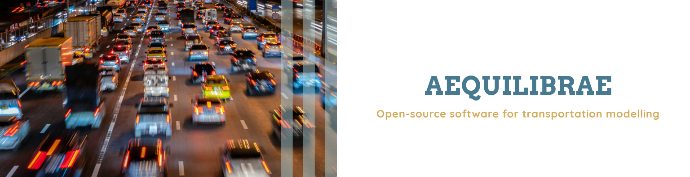
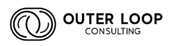
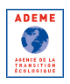
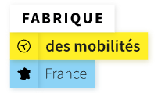
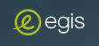

:html_theme.sidebar_secondary.remove:

.. raw:: html

    

AequilibraE
===========

|

.. rst-class:: big-font

   AequilibraE is the first comprehensive Python package for transportation modeling, and it aims to provide all the 
   resources not easily available from other open-source packages in the Python (NumPy, really) ecosystem.

.. toctree::
   :hidden:
   :maxdepth: 1

   python

Sponsors
--------

Sponsoring AequilibraE's maintenance and new features is the best way to guarantee that the bugs you need
fixed and the features your projects require are incorporated quickly into the software. Please contact
aequilibrae@outerloop.io for sponsoring opportunities.

.. image:: images/logos/sponsor5.png
    :target: https://www.ipea.gov.br
