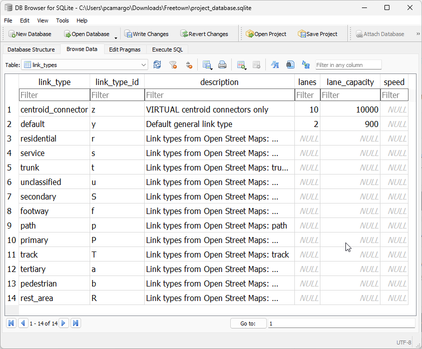

.. _tables_link_types:

Link types table
================

The **link_types** table exists to list all the link types available in the
model's network, and its main role is to support processes such as adding
centroids and centroid connectors, and to store reference data like default
lane capacity for each link type.

.. _reserved_values:

Reserved values
---------------

There are two default link types in the link_types table and that cannot be
removed from the model without breaking it.

- **centroid_connector** - These are **VIRTUAL** links added to the network with
  the sole purpose of loading demand/traffic onto the network. The identifying
  letter for this mode is **z**.

- **default** - This link type exists to facilitate the creation of networks
  when link types are irrelevant. The identifying letter for this mode is **y**.
  That is right, you have from **a** to **x** to create your own link types, as well
  as all upper-case letters of the alphabet.

.. _adding_new_link_types:

Adding new link types to a project
----------------------------------

Adding link types to a project can be done through the Python API or directly into
the 'link_types' table, which could look like the following.

.. note::

    Both 'link_type' and 'link_type_id' MUST be unique

.. _consistency_triggers:

Consistency triggers
--------------------

As it happens with the links and nodes tables, the 'link_types' table is kept consistent
with the links table through the use of database triggers.

.. _change_reserved_types:

Changes to reserved link_types
~~~~~~~~~~~~~~~~~~~~~~~~~~~~~~

For both link types mentioned about (**y** & **z**), changes to the 'link_type'
and 'link_type_id' fields, as well as the removal of any of these records are
blocked by database triggers, as to ensure that there is always one generic
physical link type and one virtual link type present in the model.

.. _change_link_type_for_link:

Changing the link type for a certain link
~~~~~~~~~~~~~~~~~~~~~~~~~~~~~~~~~~~~~~~~~

Whenever we change the 'link_type' associated to a link, we need to check whether
that link type exists in the links_table.

This condition is ensured by specific trigger checking whether the new 'link_type' 
exists in the link table. If if it does not, the transaction will fail.

We also need to update the 'link_types' field the nodes connected to the link
with a new string of all the different 'link_type_id's connected to them.

.. _adding_new_link:

Adding a new link
~~~~~~~~~~~~~~~~~

The exact same behaviour as for :ref:`change_link_type_for_link` applies in this
case, but it requires an specific trigger on the **creation** of the link.

.. _editing_lt_on_lt_table:

Editing a link type in the *link_types* table
~~~~~~~~~~~~~~~~~~~~~~~~~~~~~~~~~~~~~~~~~~~~~

Whenever we want to edit a 'link_type' in the 'link_types' table, we need to check
for two conditions:

* The new 'link_type_id' is exactly one character long
* The old 'link_type' is not in use on the network

For each condition, a specific trigger was built, and if any of the checks
fails, the transaction will fail.

The requirements for uniqueness and non-absent values are guaranteed during the
construction of the 'link_types' table by using the keys **UNIQUE** and
**NOT NULL**.

.. _adding_new_ltype:

Adding a new link type to the *link_types* table
~~~~~~~~~~~~~~~~~~~~~~~~~~~~~~~~~~~~~~~~~~~~~~~~

In this case, only the first behaviour mentioned above on
:ref:`editing_lt_on_lt_table` applies, the verification that the 'link_type_id' is
exactly one character long. Therefore only one new trigger is required.

.. _deleting_ltype:

Removing a link type from the *link_types* table
~~~~~~~~~~~~~~~~~~~~~~~~~~~~~~~~~~~~~~~~~~~~~~~~

In counterpoint, only the second behaviour mentioned above on
:ref:`editing_lt_on_lt_table` applies in this case, the verification that the old
'link_type' is not still in use by the network. Therefore only one new trigger is
required.

.. seealso::

    :func:`aequilibrae.project.network.LinkTypes`

.. include:: data_model/link_types.rst