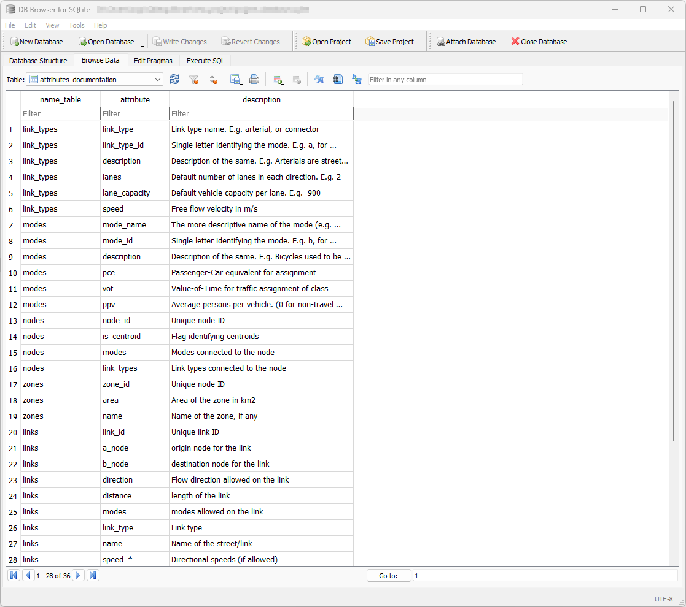

.. _parameters_metadata:

Project metadata
~~~~~~~~~~~~~~~~

Documentation is paramount for any successful modeling project. For this reason,
AequilibraE has a database table dedicated to the documentation of each field in
each of the other tables in the project. This table, called
**attributes_documentation** can be accessed directly through SQL, but it is
envisaged that its editing and consultation would happen through the Python API
itself.

As a simple table, it looks as follows:

.. seealso::

    :func:`aequilibrae.project.FieldEditor`

.. include:: data_model/attributes_documentation.rst