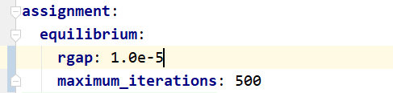
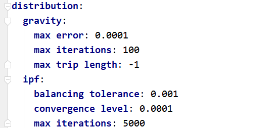
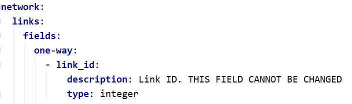
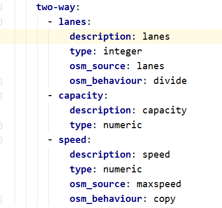
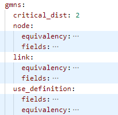
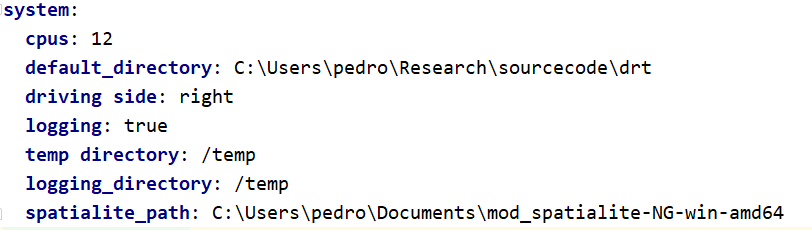
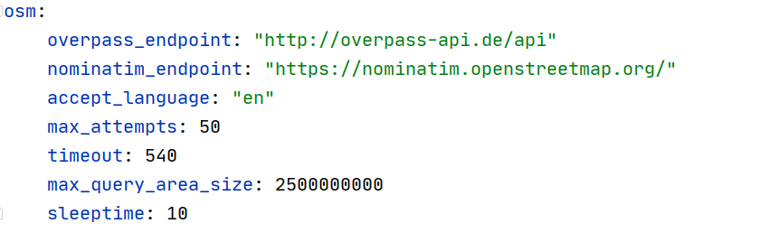

.. _parameters_file:

Parameters YAML File
====================

The parameter file holds the parameters information for a certain portion of the software.

* :ref:`parameters_assignment`
* :ref:`parameters_distribution`
* :ref:`parameters_network`
* :ref:`parameters_system`
* :ref:`parameters_osm`

.. _parameters_assignment:

Assignment
----------

The assignment section of the parameter file is the smallest one, and it
contains only the convergence criteria for assignment in terms of the maximum number
of iterations and target Relative Gap.

Although these parameters are required to exist in the parameters file, one can
override them during the assignment, as detailed in :ref:`convergence_criteria`.

.. _parameters_distribution:

Distribution
------------

The distribution section of the parameter file is also fairly short, as it
contains only the parameters for number of maximum iterations, convergence level
and maximum trip length to be applied in Iterative Proportional Fitting and
synthetic gravity models, as shown below.

.. _parameters_network:

Network
-------

There are four groups of parameters under the network section: *links*, *nodes*,
*OSM*, and *GMNS*. The first are basically responsible for the design of the network 
to be created in case a new project/network is to bre created from scratch, and for
now each one of these groups contains only a single group of parameters called 
*fields*.

Link Fields
~~~~~~~~~~~

The section for link fields are divided into *one-way* fields and *two-way* fields, where the
two-way fields will be created by appending *_ab* and *_ba* to the end of each field's name.

There are 5 fields which cannot be changed, as they are mandatory fields for an AequilibraE
network, and they are **link_id**, **a_node**, **b_node**, **direction**, **distance** and
**modes**. The field **geometry** is also default, but it is not listed in the parameter file
due to its distinct nature.

The list of fields required in the network are enumerated as an array under either *one-way* or
*two-way* in the parameter file, and each field is a dictionary/hash that has the field's name
as the only key and under which there is a field for *description* and a field for *data type*.
The data types available are those that exist within the
`SQLite specification <https://www.sqlite.org/datatype3.html>`_ . We recommend limiting yourself
to the use of **integer**, **numeric** and **varchar**.

For the case of all non-mandatory fields, two more parameters are possible: *osm_source* and
*osm_behaviour*. Those two fields provide the necessary information for importing data from
`Open Street Maps <https://www.openstreetmap.org/>`_ in case such resource is required, and
they work in the following way:

*osm_source*: The name of the tag for which data needs to be retrieved. Common tags are
**highway**, **maxspeed** and **name**. The import result will contain a null value for all
links that do not contain a value for such tag.

Within OSM, there is the concept of tags for each link direction, such as **maxspeed:forward**
and **maxspeed:backward**. However, it is not always that a two-directional link contains tag
values for both directions, and it might have only a tag value for **maxspeed**.

Although for **maxspeed** (which is the value for posted speed) we might want to copy the same
value for both directions, that would not be true for parameters such as **lanes**, which we
might want to split in half for both directions (cases with an odd number of lanes usually have
forward/backward values tagged). For this reason, one can use the parameter *osm_behaviour*
to define what to do with numeric tag values that have not been tagged for both directions.
the allowed values for this parameter are **copy** and **divide**, as shown below.

The example below also shows that it is possible to mix fields that will be imported from
`OSM <https://www.openstreetmap.org/>`_ posted speed and number of lanes, and fields that need
to be in the network but should not be imported from OSM, such as link capacities.

Node fields
~~~~~~~~~~~

The specification for node fields is similar to the one for link fields, with the key difference
that it does not make sense to have fields for one or two directions and that it is not possible
yet to import any tagged values from OSM at the moment, and therefore the parameter *osm_source*
would have no effect here.

Open Street Maps
~~~~~~~~~~~~~~~~
The **OSM** group of parameters has two specifications: **modes** and **all_link_types**.

**modes** contains the list of key tags we will import for each mode. Description of tags can be found on
`Open-Street Maps <https://wiki:openstreetmap:org/wiki/Key:highway:>`_, and we recommend
not changing the standard parameters unless you are exactly sure of what you are doing.

For each mode to be imported there is also a mode filter to control for non-default
behaviour. For example, in some cities pedestrians a generally allowed on cycleways, but
they might be forbidden in specific links, which would be tagged as **pedestrian:no**.
This feature is stored under the key *mode_filter* under each mode to be imported.

There is also the possibility that not all keywords for link types for the region being
imported, and therefore unknown link type tags are treated as a special case for each
mode, and that is controlled by the key *unknown_tags* in the parameters file.

GMNS
~~~~

The **GMNS** group of parameters has four specifications: **critical_dist**, **link**,
**node**, and **use_definition**.

|

**critical_dist** is a numeric threshold for the distance.

Under the keys **links**, **nodes**, and **use_definition** there are the fields 
*equivalency* and *fields*. They represent the equivalency between GMNS and 
AequilibraE data fields and data types for each field.

.. _parameters_system:

System
------

The system section of the parameters file holds information on the
number of threads used in multi-threaded processes, logging and temp folders
and whether we should be saving information to a log file at all, as exemplified
below.

The number of CPUs have a special behaviour defined, as follows:

* **cpus<0** : The system will use the total number logical processors
  **MINUS** the absolute value of **cpus**

* **cpus=0** : The system will use the total number logical processors available

* **cpus>0** : The system will use exactly **cpus** for computation, limited to
   the total number logical processors available

A few of these parameters, however, are targeted at its QGIS plugin, which is
the case of the *driving side* and  *default_directory* parameters.

.. _parameters_osm:

Open Streeet Maps
-----------------
The OSM section of the parameter file is relevant only when one plans to
download a substantial amount of data from an Overpass API, in which case it is
recommended to deploy a local Overpass server.

The user is also welcome to change the maximum area for a single query to the
Overpass API (m\ :sup:`2`) and the pause duration between successive
requests *sleeptime*.

It is also possible to set a custom address for the Nominatim server, but its
use by AequilibraE is so small that it is likely not necessary to do so.
