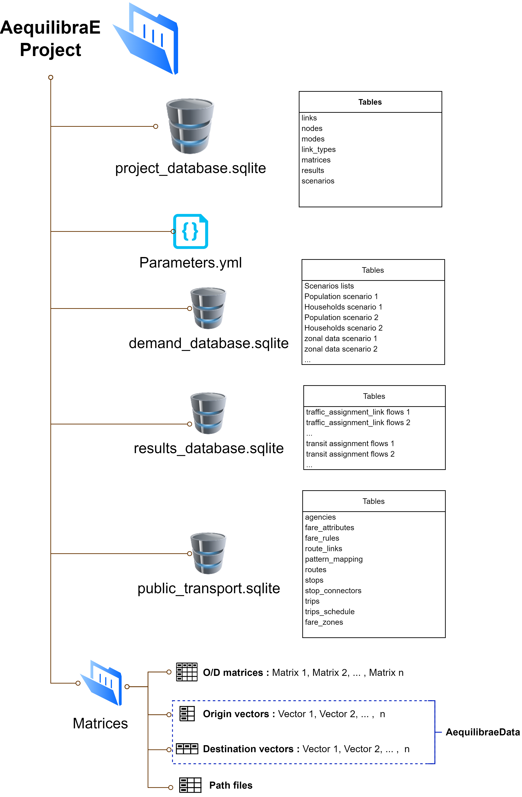

.. _project:

The AequilibraE project
-----------------------

Similarly to commercial packages, any AequilibraE project must have a certain
structure and follow a certain set of guidelines in order for software to
work correctly.

One of these requirements is that AequilibraE currently only supports one
projection system for all its layers, which is the **EPSG:4326** (WGS84).
This limitation is planned to be lifted at some point, but it does not impact
the result of any modeling procedure.

AequilibraE is built on the shoulder of much older and more established
projects, such as `SQLite <https://sqlite.org/index.html>`_,
`SpatiaLite <http://www.gaia-gis.it/gaia-sins/>`_ and `NumPy
<https://numpy.org/>`_, as well as reasonably new industry standards such as the
`Open-Matrix format <https://github.com/osPlanning/omx>`_.

Impressive performance, portability, self containment and open-source character
of these pieces of software, along with their large user base and wide
industry support make them solid options to be AequilibraE's data backend.

Since working with Spatialite is not just a matter of a *pip install*,
please refer to :ref:`dependencies`. For QGIS users this is not a concern, while
for Windows users this dependency is automatically handled under the hood, but
the details are also discussed in the aforementioned dependencies section.

Project structure
~~~~~~~~~~~~~~~~~

Since version 0.7, the AequilibraE project consists of a main folder, where a
series of files and sub folders exist, and the current project organization
is as follows:

|

The main component of an AequilibraE model is the **project_database.sqlite**,
where the network and zoning system are stored and maintained, as well as the
documentation records of all matrices and procedure results stored in other
folders and databases.

The second key component of any model is the **parameters.yaml** file, which
holds the default values for a number of procedures (e.g. assignment
convergence), as well as the specification for networks imported from
Open-Street Maps and other general *import-export* parameters.

The third and last required component of an AequilibraE model is the Matrices
folder, where all the matrices in binary format (in AequilibraE's native AEM or
OMX formats) should be placed. This folder can be empty, however, as no
particular matrix is required to exist in an AequilibraE model.

The database that stores results in tabular format (e.g. link loads from traffic
assignment), **results_database.sqlite** is created on-the-fly the first time
a command to save a tabular result into the model is invoked, so the user does
not need to worry about its existence until it is automatically created.

The **demand_database.sqlite** is envisioned to hold all the demand-related
information, and it is not yet structured within the AequilibraE code, as there
is no pre-defined demand model available for use with AequilibraE. This database
is not created with the model, but we recommend using this concept on
your demand models.

The **public_transport.sqlite** database holds a *transportation route system* for
a model, and has been introduced in AequilibraE version 0.9. This database is
also created *on-the-fly* when the user imports a GTFS source into an AequilibraE
model, but there is still no support for manually or programmatically adding routes
to a route system as of yet.

Package components: A conceptual view
^^^^^^^^^^^^^^^^^^^^^^^^^^^^^^^^^^^^^

As all the components of an AequilibraE model based on open-source software and
open-data standards, modeling with AequilibraE is a little different from
modeling with commercial packages, as the user can read and manipulate model
components outside the software modeling environments (Python and QGIS).

Thus, using/manipulating each one of an AequilibraE model components can be done
in different ways depending on the tool you use for such.

It is then important to highlight that AequilibraE, as a software, is divided in
three very distinctive layers.  The first, which is responsible for tables
consistent with each other (including links and nodes, modes and link_types),
are embedded in the data layer in the form of geo-spatial database triggers. The
second is the Python API, which provides all of AequilibraE's core algorithms
and data manipulation facilities. The third is the GUI implemented in QGIS,
which provides a user-friendly interface to access the model, visualize results
and run procedures.

These software layers are *stacked* and depend on each other, which means that any
network editing done in SQLite, Python or QGIS will go through the SpatiaLite triggers,
while any procedure such as traffic assignment done in QGIS is nothing more than an
API call to the corresponding Python method.
