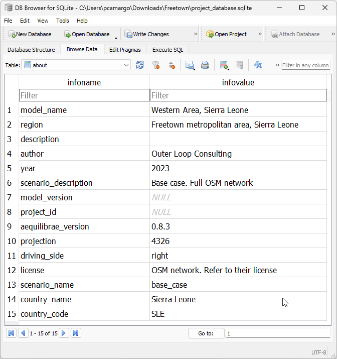

.. _tables_about:

About table
~~~~~~~~~~~

The **about** table is the simplest of all tables in the AequilibraE project,
but it is the one table that contains the documentation about the project, and 
it is therefore crucial for project management and quality assurance during
modeling projects.

It is possible to create new information fields programmatically. Once
the new field is added, the underlying database is altered and the field will
be present when the project is open during future use.

This table, which can look something like the example from image below, is required
to exist in AequilibraE but it is not currently actively used by any process.
We strongly recommend not to edit the information on **projection** and
**aequilibrae_version**, as these are fields that might or might not be used by
the software to produce valuable information to the user with regards to
opportunities for version upgrades.

An API for editing the contents of this database is available from the API documentation.

.. seealso::

    :func:`aequilibrae.project.About`
