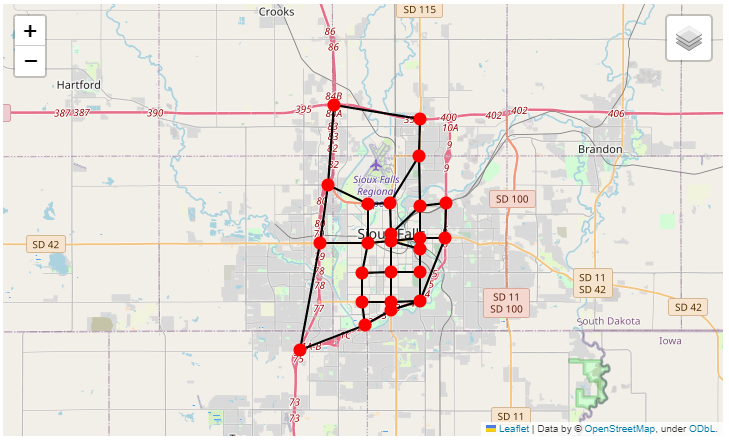

.. _exporting_to_gmns:

Exporting AequilibraE model to GMNS format
==========================================

After loading an existing AequilibraE project, you can export it to GMNS format. 

|

As of July 2022, it is possible to export an AequilibraE network to the following
tables in GMNS format:

* link table
* node table
* use_definition table

This list does not include the optional use_group table, which is an optional argument
of the ``create_from_gmns()`` function, because mode groups are not used in the 
AequilibraE modes table.

In addition to all GMNS required fields for each of the three exported tables, some
other fields are also added as riminder of where the features came from when looking 
back at the AequilibraE project.

.. note::

    **When a node is identified as a centroid in the AequilibraE nodes table, this**
    **information is transmitted to the GMNS node table by means of the field**
    **'node_type', which is set to 'centroid' in this case. The 'node_type' field**
    **is an optinal field listed in the GMNS node table specification.**

You can find the GMNS specification
`here <https://github.com/zephyr-data-specs/GMNS/tree/develop/docs/spec>`_.
