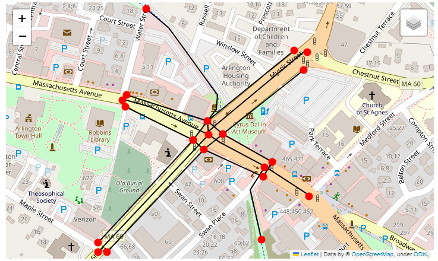

.. _importing_from_gmns:

Importing from files in GMNS format
===================================

Before importing a network from a source in GMNS format, it is imperative to know 
in which spatial reference its geometries (links and nodes) were created. If the SRID
is different than 4326, it must be passed as an input using the argument 'srid'.

|
As of July 2022, it is possible to import the following files from a GMNS source:

* link table;
* node table;
* use_group table;
* geometry table.

You can find the specification for all these tables in the GMNS documentation, 
`here <https://github.com/zephyr-data-specs/GMNS/tree/development/Specification_md>`_.

By default, the method ``create_from_gmns()`` read all required and optional fields
specified in the GMNS link and node tables specification. If you need it to read 
any additional fields as well, you have to modify the AequilibraE parameters as
shown in the :ref:`example <sphx_glr__auto_examples_plot_import_from_gmns.py>`.
When adding a new field to be read in the parameters.yml file, it is important to 
keep the "required" key set to False, since you will always be adding a non-required 
field. Required fields for a specific table are only those defined in the GMNS
specification.

.. note::

    **In the AequilibraE nodes table, if a node is to be identified as a centroid, its**
    **'is_centroid' field has to be set to 1. However, this is not part of the GMNS**
    **specification. Thus, if you want a node to be identified as a centroid during the**
    **import process, in the GMNS node table you have to set the field 'node_type' equals**
    **to 'centroid'.**