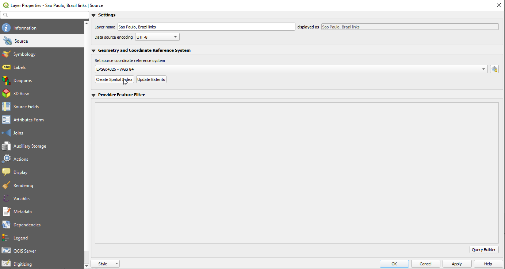

.. _importing_from_osm:

Importing from Open Street Maps
===============================

Please review the information :ref:`parameters_osm`

.. note::

   **ALL links that cannot be imported due to errors in the SQL insert**
   **statements are written to the log file with error message AND the SQL**
   **statement itself, and therefore errors in import can be analyzed for**
   **re-downloading or fixed by re-running the failed SQL statements after**
   **manual fixing**

.. _sqlite_python_limitations:

Python limitations
------------------
As it happens in other cases, Python's usual implementation of SQLite is
incomplete, and does not include R-Tree, a key extension used by Spatialite for
GIS operations.

For this reason, AequilibraE's default option when importing a network from OSM
is to **NOT create spatial indices**, which renders the network consistency
triggers useless.

If you are using a vanilla Python installation (your case if you are not sure),
you can import the network without creating indices, as shown below.

.. code-block:: python

  from aequilibrae.project import Project

  p = Project()
  p.new('path/to/project/new/folder')
  p.network.create_from_osm(place_name='my favorite place')
  p.conn.close()

And then manually add the spatial index on QGIS by adding both links and nodes
layers to the canvas, and selecting properties and clicking on *create spatial*
*index* for each layer at a time. This action automatically saves the spatial
indices to the sqlite database.

|
If you are an expert user and made sure your Python installation was compiled
against a complete SQLite set of extensions, then go ahead an import the network
with the option for creating such indices.

.. code-block:: python

  from aequilibrae.project import Project

  p = Project()
  p.new('path/to/project/new/folder/')
  p.network.create_from_osm(place_name='my favorite place', spatial_index=True)
  p.conn.close()

If you want to learn a little more about this topic, you can access this
`blog post <https://pythongisandstuff.wordpress.com/2015/11/11/python-and-spatialite-32-bit-on-64-bit-windows/>`_
or check out the SQLite page on `R-Tree <https://www.sqlite.org/rtree.html>`_.

If you want to take a stab at solving your SQLite/SpatiaLite problem
permanently, take a look at this
`other blog post <https://www.xl-optim.com/spatialite-and-python-in-2020/>`_.

Please also note that the network consistency triggers will NOT work before
spatial indices have been created and/or if the editing is being done on a
platform that does not support both RTree and Spatialite.
