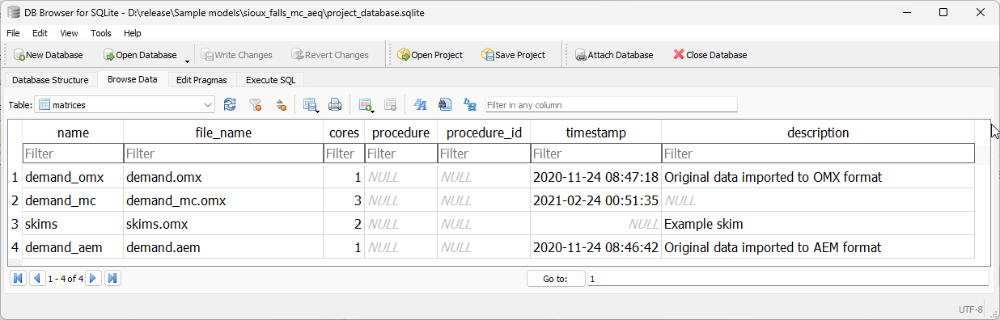

.. _matrix_table:

Matrices table
==============

The **matrices** table in the project_database is nothing more than an index of
all matrix files contained in the matrices folder inside the AequilibraE project.

This index, which looks like below, has two main columns. The first one is the
**file_name**, which contains the actual file name in disk as to allow
AequilibraE to find the file, and **name**, which is the name by which the user
should refer to the matrix in order to access it through the API.

As AequilibraE is fully compatible with OMX, the index can have a mix of matrix
types (AEM and OMX) without prejudice to functionality.

.. seealso::

    * :func:`aequilibrae.project.Matrices`
        Class documentation
    * :ref:`matrices_network_data_model`
        Data model
