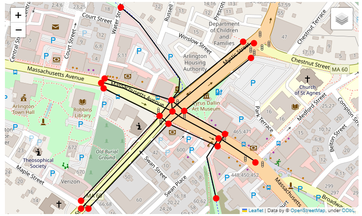
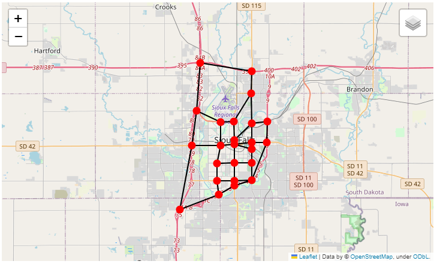

Importing and exporting the network
-----------------------------------

Currently AequilibraE can import links and nodes from a network from OpenStreetMaps, 
GMNS, and from link layers. AequilibraE can also export the existing network
into GMNS format. There is some valuable information on these topics in the following
sections.

.. _importing_from_osm:

Importing from OpenStreetMap
~~~~~~~~~~~~~~~~~~~~~~~~~~~~

You can check more specifications on OSM download on the :ref:`parameters_file`.

.. note::

   All links that cannot be imported due to errors in the SQL insert
   statements are written to the log file with error message AND the SQL
   statement itself, and therefore errors in import can be analyzed for
   re-downloading or fixed by re-running the failed SQL statements after
   manual fixing.

Python limitations
``````````````````

As it happens in other cases, Python's usual implementation of SQLite is
incomplete, and does not include R-Tree, a key extension used by SpatiaLite for
GIS operations.

For this reason, AequilibraE's default option when importing a network from OSM
is to **NOT create spatial indices**, which renders the network consistency
triggers useless.

If you are using a vanilla Python installation (your case if you are not sure),
you can import the network without creating indices, as shown below.

.. code-block:: python

    from aequilibrae.project import Project

    p = Project()
    p.new('path/to/project/new/folder')
    p.network.create_from_osm(place_name='my favorite place')
    p.conn.close()

And then manually add the spatial index on QGIS by adding both links and nodes
layers to the canvas, and selecting properties and clicking on *create spatial*
*index* for each layer at a time. This action automatically saves the spatial
indices to the sqlite database.

.. image:: ../../images/qgis_creating_spatial_indices.png
    :align: center
    :alt: Adding Spatial indices with QGIS

If you are an expert user and made sure your Python installation was compiled
against a complete SQLite set of extensions, then go ahead an import the network
with the option for creating such indices.

.. code-block:: python

    from aequilibrae.project import Project

    p = Project()
    p.new('path/to/project/new/folder/')
    p.network.create_from_osm(place_name='my favorite place', spatial_index=True)
    p.conn.close()

If you want to learn a little more about this topic, you can access this
`blog post <https://pythongisandstuff.wordpress.com/2015/11/11/python-and-spatialite-32-bit-on-64-bit-windows/>`_
or check out the SQLite page on `R-Tree <https://www.sqlite.org/rtree.html>`_.
If you want to take a stab at solving your SQLite/SpatiaLite problem
permanently, take a look at this
`other blog post <https://www.xl-optim.com/spatialite-and-python-in-2020/>`_.

Please also note that the network consistency triggers will NOT work before
spatial indices have been created and/or if the editing is being done on a
platform that does not support both R-Tree and SpatiaLite.

.. seealso::

    * :func:`aequilibrae.project.Network.create_from_osm`
        Function documentation
    * :ref:`plot_from_osm`
        Usage example

Importing from link layer
~~~~~~~~~~~~~~~~~~~~~~~~~

It is possible to create an AequilibraE project from a link layer, such as a \*.csv file that
contains geometry in WKT, for instance. You can check an example with all functions used in
:ref:`the following example <project_from_link_layer>`.

.. _importing_from_gmns_file:

Importing from files in GMNS format
~~~~~~~~~~~~~~~~~~~~~~~~~~~~~~~~~~~

Before importing a network from a source in GMNS format, it is imperative to know 
in which spatial reference its geometries (links and nodes) were created. If the SRID
is different than 4326, it must be passed as an input using the argument 'srid'.



As of July 2022, it is possible to import the following files from a GMNS source:

* link table;
* node table;
* use_group table;
* geometry table.

You can find the specification for all these tables in the GMNS documentation, 
`here <https://github.com/zephyr-data-specs/GMNS/tree/develop/docs/spec>`_.

By default, the method ``create_from_gmns()`` read all required and optional fields
specified in the GMNS link and node tables specification. If you need it to read 
any additional fields as well, you have to modify the AequilibraE parameters as
shown in the :ref:`example <import_from_gmns>`.

When adding a new field to be read in the parameters.yml file, it is important to 
keep the "required" key set to False, since you will always be adding a non-required 
field. Required fields for a specific table are only those defined in the GMNS
specification.

.. note::

    In the AequilibraE nodes table, if a node is to be identified as a centroid, its
    'is_centroid' field has to be set to 1. However, this is not part of the GMNS
    specification. Thus, if you want a node to be identified as a centroid during the
    import process, in the GMNS node table you have to set the field 'node_type' equals
    to 'centroid'.

.. seealso::

    * :func:`aequilibrae.project.Network.create_from_gmns`
        Function documentation
    * :ref:`import_from_gmns`
        Usage example

.. _aequilibrae_to_gmns:

Exporting AequilibraE model to GMNS format
~~~~~~~~~~~~~~~~~~~~~~~~~~~~~~~~~~~~~~~~~~

After loading an existing AequilibraE project, you can export it to GMNS format. 



As of July 2022, it is possible to export an AequilibraE network to the following
tables in GMNS format:

* link table
* node table
* use_definition table

This list does not include the optional 'use_group' table, which is an optional argument
of the GMNS function, because mode groups are not used in the AequilibraE modes table.

In addition to all GMNS required fields for each of the three exported tables, some
other fields are also added as reminder of where the features came from when looking 
back at the AequilibraE project.

.. note::

    When a node is identified as a centroid in the AequilibraE nodes table, this
    information is transmitted to the GMNS node table by means of the field
    'node_type', which is set to 'centroid' in this case. The 'node_type' field
    is an optinal field listed in the GMNS node table specification.

You can find the GMNS specification
`here <https://github.com/zephyr-data-specs/GMNS/tree/develop/docs/spec>`_.

.. seealso::

    * :func:`aequilibrae.project.Network.export_to_gmns`
        Function documentation
    * :ref:`export_to_gmns`
        Usage example
