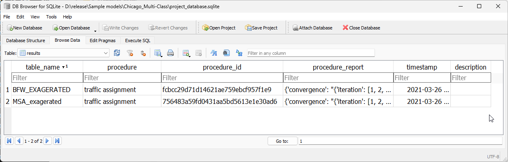

.. _tables_results:

Results
=======

The **results** table exists to hold the metadata for the results stored in the
**results_database.sqlite** in the same folder as the model database. In that,
the 'table_name' field is unique and must match exactly the table name in the
**results_database.sqlite**.

Although those results could as be stored in the model database, it is possible
that the number of tables in the model file would grow too quickly and would
essentially clutter the **project_database.sqlite**.

As a simple table, it looks as follows:

.. include:: data_model/results.rst