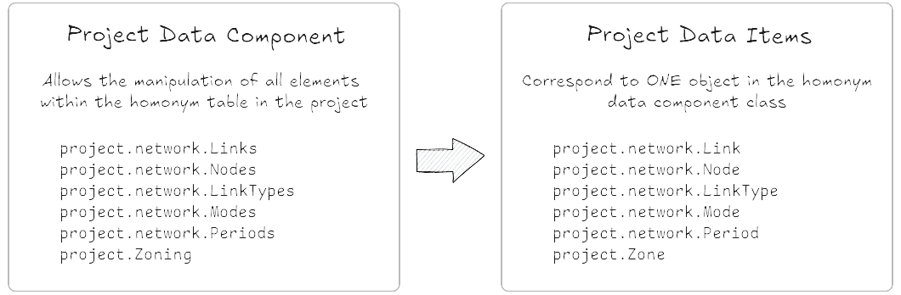

.. _project_components:

Data Components
=======================

In the :ref:`aeq_project_structure` section, we present the main file components and folders that
consists an AequilibraE project. We also present in :ref:`aeq_project_database_tables` all tables
that are part of the project database, how do they look like, and what fields do they have.

The components of an AequilibraE project are:

* ``project.About``
* ``project.FieldEditor``
* ``project.Log``
* ``project.Matrices``
* ``project.Network``
* ``project.Zoning``

Network and Zoning are the components that contain the geo-spatial information of the project, such
as links, nodes, and zones, which can also be manipulated. In the Network component, there are also
non-geometric classes related to the project network, such as Modes, LinkTypes, and Periods.

One important thing to observe is that related to each component in Matrices, Network, andd Zoning, there is an
object with similar name that corresponds to one object in the class. Thus ``project.network.links``
enables the access to manipulate the 'links' table, and each item in the items table is a 
``Link`` object.

In this section, we'll briefly discuss about the project components without geo-spatial information.

``project.about``
-----------------

This class provides an interface for editing the 'about' table of a project. We can add new fields or
edit the existing ones as necessary, but everytime you add or modify a field, you have to write back
this information, otherwise it will be lost.

.. doctest::
    >>> from aequilibrae import Project

    >>> project = Project()
    >>> project.open("/tmp/accessing_sfalls_data")

    >>> project.about.add_info_field("my_new_field")
    >>> project.about.my_new_field = "add some useful information about the field"
    
    # We can add data to an existing field
    >>> project.about.author = "Your Name" 

    # And save our modifications
    >>> project.about.write_back()

    # To assert if 'my_new_field' was added to the 'about' table, we can check the characteristics 
    # stored in the table by returning a list with all characteristics in the 'about' table
    >>> project.about.list_fields() # doctest: +ELLIPSIS
    ['model_name', ..., 'my_new_field']

    # The 'about' table is created automatically when a project is created, but if you're 
    # loading a project created with an older AequilibraE version that didn't contain it, 
    # it is possible to create one too.
    >>> project.about.create()

    >>> project.close()

.. admonition:: References

    * :ref:`tables_about`
        Table documentation

.. seealso::

    * :func:`aequilibrae.procedure.About`
        Class documentation

``project.FieldEditor``
-----------------------

The ``FieldEditor`` allows the user to edit the project data tables, and it has two different purposes:

* Managing data tables, through the addition/deletion of fields
* Editing the tables' metadata (aka the description of each field)

This class is directly accessed from within the corresponding module one wants to edit.

.. doctest::

    >>> project = Project()
    >>> project.open("/tmp/accessing_nauru_data")

    # We'll edit the fields in the 'nodes' table
    >>> node_fields = project.network.nodes.fields

    # To add a new field to the 'nodes' table
    >>> node_fields.add("my_new_field", "this is an example of AequilibraE's funcionalities", "TEXT")

    # Don't forget to save these modifications
    >>> node_fields.save()

    # To edit the description of a field
    >>> node_fields.osm_id = "number of the osm node_id"

    # Or just to access the description of a field
    >>> node_fields.modes
    'Modes connected to the node'

    # One can also check all the fields in the 'nodes' table.
    >>> node_fields.all_fields() # doctest: +ELLIPSIS
    ['is_centroid', ..., 'my_new_field']

    >>> project.close()

All field descriptions are kept in the table 'attributes_documentation'.

.. admonition:: References

    * :ref:`parameters_metadata`
        Table documentation

.. seealso::

    *  :func:`aequilibrae.project.FieldEditor`
        Class documentation

``project.log``
---------------

Every AequilibraE project contains a log file that holds information on all the project procedures.
It is possible to access the log file contents, as presented in the next code block.

.. doctest::

    >>> project = Project()
    >>> project.open("/tmp/accessing_nauru_data")

    >>> project_log = project.log()

    # Returns a list with all entires in the log file.
    >>> print(project_log.contents()) # doctest: +ELLIPSIS
    ['2021-01-01 15:52:03,945;aequilibrae;INFO ; Created project on D:/release/Sample models/nauru', ...]

    # If your project's log is getting cluttered, it is possible to clear it. 
    # Use this option wiesly once the deletion of data in the log file can't be undone.
    >>> project_log.clear()

    >>> project.close()

.. admonition:: References

    * :ref:`useful-log-tips`
        Usage example

.. seealso::
    
    * :func:`aequilibrae.project.Log`
        Class documentation
    
``project.matrices``
--------------------

This method ia a gateway to all the matrices available in the model, which allows us to update the
records in the 'matrices' table. Each item in the 'matrices' table  is a ``MatrixRecord`` object.

.. doctest::

    >>> project = Project()
    >>> project.open("/tmp/accessing_sfalls_data")

    >>> matrices = project.matrices

    # One can also check all the project matrices as a Pandas' DataFrame
    >>> matrices.list() # doctest: +SKIP

    # We can add a naw matrix
    >>> matrices.new_record() # doctest: +SKIP
    
    # To delete a matrix from the 'matrices' table, we can delete the record directly
    >>> matrices.delete_record("demand_mc")
    
    # or by selecting the matrix and deleting it
    >>> mat_record = matrices.get_record("demand_omx")
    >>> mat_record.delete()

    # If you're unsure if you have a matrix in you project, you can check if it exists
    # This function will return `True` or `False`
    >>> matrices.check_exists("my_matrix")
    False

    # If a matrix was added or deleted by an external process, you should update or clean
    # your 'matrices' table to keep your project organised.
    >>> matrices.update_database()  # in case of addition
    
    >>> matrices.clear_database()  # in case of deletion

    # To reload the existing matrices in memory once again
    >>> matrices.reload()

    # Similar to the `get_record` function, we have the `get_matrix`, which allows you to
    # get an AequilibraE matrix.
    >>> matrices.get_matrix("demand_aem") # doctest: +SKIP

    >>> project.close()

.. admonition:: References

    * :ref:`matrix_table`
        Table documentation

.. seealso::

    * :func:`aequilibrae.project.Matrices`
        Class documentation

``project.network.link_types``
------------------------------

This method allows you to access the API resources to manipulate the 'link_types' table.
Each item in the 'link_types' table is a ``LinkType`` object.

.. doctest::

    >>> project = Project()
    >>> project.open("/tmp/accessing_coquimbo_data")

    >>> link_types = project.network.link_types

    >>> new_link_type = link_types.new("A")  # Create a new LinkType with ID 'A'

    # We can add information to the LinkType we just created
    >>> new_link_type.description = "This is a description"
    >>> new_link_type.speed = 35
    >>> new_link_type.link_type = "Arterial"

    # To save the modifications for `new_link_type`
    >>> new_link_type.save()

    # To create a new field in the 'link_types' table, you can call the function `fields`
    # to return a FieldEditor instance, which can be edited
    >>> link_types.fields.add("my_new_field", "this is an example of AequilibraE's funcionalities", "TEXT")

    # You can also remove a LinkType from a project using its `link_type_id`
    >>> link_types.delete("A")

    # And don't forget to save the modifications you did in the 'link_types' table
    >>> link_types.save()

    # To check all `LinkTypes` in the project as a dictionary whose keys are the `link_type_id`'s
    >>> link_types.all_types() # doctest: +ELLIPSIS
    {'z': <aequilibrae.project.network.link_type.LinkType object at 0x...>} 

    # There are two ways to get a LinkType from the 'link_types' table
    # using the `link_type_id`
    >>> get_link = link_types.get("p")

    # or using the `link_type`
    >>> get_link = link_types.get_by_name("primary")

    >>> project.close()

.. admonition:: References

    * :ref:`tables_link_types`
        Table documentation

.. seealso::

    * :func:`aequilibrae.project.LinkTypes`
        Class documentation

``project.network.modes``
-------------------------

This method allows you to access the API resources to manipulate the 'modes' table.
Each item in 'modes' table is a ``Mode`` object.

.. doctest::

    >>> project = Project()
    >>> project.open("/tmp/accessing_coquimbo_data")

    >>> modes = project.network.modes

    # We create a new mode
    >>> new_mode = modes.new("k")
    >>> new_mode.mode_name = "flying_car"

    # And add it to the modes table
    >>> modes.add(new_mode)

    # When we add a new mode to the 'modes' table, it is automatically saved in the table
    # But we can continue editing the modes, and save them as we modify them
    >>> new_mode.description = "Like the one in the cartoons"
    >>> new_mode.save()

    # You can also remove a Mode from a project using its ``mode_id``
    >>> modes.delete("k")

    # To check all `Modes` in the project as a dictionary whose keys are the `mode_id`'s
    >>> modes.all_modes() # doctest: +ELLIPSIS
    {'b': <aequilibrae.project.network.mode.Mode object at 0x...>}

    # There are two ways to get a Mode from the 'modes' table
    # using the ``mode_id``
    >>> get_mode = modes.get("c")
    
    # or using the ``mode_name``
    >>> get_mode = modes.get_by_name("car")

    >>> project.close()

.. admonition:: References

    * :ref:`tables_modes`
        Table documentation

.. seealso::

    * :func:`aequilibrae.project.Modes`
        Class documentation

``project.network.periods``
---------------------------

This method allows you to access the API resources to manipulate the 'periods' table.
Each item in the 'periods' table is a ``Period`` object.

.. doctest::

    >>> project = Project()
    >>> project.open("/tmp/accessing_coquimbo_data")

    >>> periods = project.network.periods

    # Let's add a new field to our 'periods' table
    >>> periods.fields.add("my_field", "This is field description", "TEXT")

    # To save this modification, we must refresh the table
    >>> periods.refresh_fields()

    # Let's get our default period and change the description for our new field
    >>> select_period = periods.get(1)
    >>> select_period.my_field = "hello world"

    # And we save this period modification
    >>> select_period.save()

    # To see all periods data as a Pandas' DataFrame
    >>> all_periods = periods.data

    # To add a new period
    >>> new_period = periods.new_period(2, 21600, 43200, "6AM to noon")

    # It is also possible to renumber a period
    >>> new_period.renumber(9)

    # And check the existing data fields for each period
    >>> new_period.data_fields()
    ['period_id', 'period_start', 'period_end', 'period_description', 'my_field']

    # Saving can be done after finishing all modifications in the table but for the sake
    # of this example, we'll save the addition of a new period to our table right away
    >>> periods.save()

    >>> project.close()

.. admonition:: References

    * :ref:`tables_period`
        Table documentation

.. seealso::

    * :func:`aequilibrae.project.Periods`
        Class documentation
