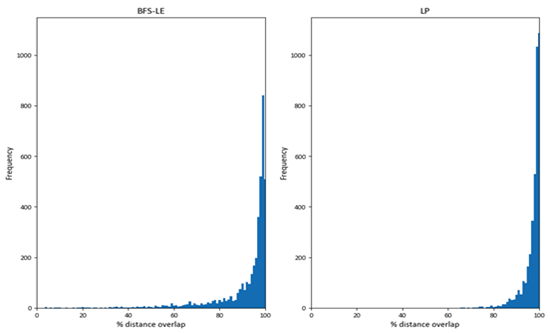

Choice set generation algorithms
================================

The generation of choice sets for route choice algorithms is the most time-consuming step of most well-established
route choice algorithms, and that's certainly the case in AequilibraE's implementation of the Path Size Logit.

Consistent with AequilibraE's software architecture, the route choice set generation is implemented as a separate
Cython module that integrates into existing AequilibraE infrastructure; this allows it to benefit from established
optimisations such as graph compression and high-performance data structures.

A key point of difference in AequilibraE's implementation comes from its flexibility in allowing us to reconstruct
a compressed graph for computation between any two points in the network. This is a significant advantage when
preparing datasets for model estimation, as it is possible to generate choice sets between exact network positions
collected from observed data (e.g. vehicle GPS data, Location-Based services, etc.), which is especially relevant in
the context of micro-mobility and active modes.

Choice set construction algorithms
----------------------------------

There are two different route choice set generation algorithms available in AequilibraE: Link Penalisation (LP),
and Breadth-First Search with Link-Elimination (BFS-LE). The underlying implementation relies on the use of
several specialized data structures to minimise the overhead of route set generation and storage, as both methods
were implemented in Cython for easy access to existing AequilibraE methods and standard C++ data structures.

The process is designed to run multiple calculations simultaneously across the origin-destination pairs, utilising
multi-core processors and improving computational performance. As Rieser-Schüssler et al. [1]_ noted, pathfinding is
the most time-consuming stage in generating a set of route choices. Despite the optimisations implemented to reduce the
computational load of maintaining the route set generation overhead, computational time is still not trivial, as
pathfinding remains the dominant factor in determining runtime.

Link-Penalization
~~~~~~~~~~~~~~~~~

The link Penalization (LP) method is one of the most traditional approaches for generating route choice sets. It
consists of an iterative approach where, in each iteration, the shortest path between the origin and the destination
in question is computed. After each iteration, however, a pre-defined penalty factor is applied to all links that are
part of the path found, essentially modifying the graph to make the previously found path less attractive.

The LP method is a simple and effective way to generate route choice sets, but it is sensitive to the penalty factor,
which can significantly affect the quality of the generated choice sets, requiring experimentation during the model
development/estimation stage.

The overhead of the LP method is negligible due to AequilibraE's internal data structures that allow for easy
data manipulation of the graph in memory.

BFS-LE
~~~~~~

At a high level, BFS-LE operates on a graph of graphs, exploring unique graphs linked by a single removed edge.
Each graph can be uniquely categorised by a set of removed links from a common base graph, allowing us to avoid
explicitly maintaining the graph of graphs. Instead, generating and storing that graph's set of removed links in the
breadth-first search (BFS) order.

To efficiently store and determine the uniqueness of a new route or removed link sets, we used modified hash functions
with properties that allowed us to store and nest them within standard C++ data structures. We used a commutative hash
function for the removed link sets to allow for amortised O(1) order-independent uniqueness testing. While the removed
link sets are always constructed incrementally, we did not opt for an incremental hash function as we did not deem this
a worthwhile optimisation. The removed link sets rarely grew larger than double digits, even on a network with over
600,000 directed links. This may be an area worth exploring for networks with a significantly larger number of desired
routes than links between ODs.

For uniqueness testing of discovered routes, AequilibraE implements a traditional, non-commutative hash function.
Since cryptographic security was not a requirement for our purposes, we use a fast general-purpose integer hash function.
Further research could explore the use of specialised integer vector hash functions. As we did not find the hashing
had a non-negligible influence on the runtime performance, this optimisation was not tested.

AequilibraE also implements a combination of LP and BFS-LP as an optional feature to the latter algorithm, as
recommended by Rieser-Schüssler et al. [1]_, which is also a reference for further details on the BFS-LE algorithm.

Experiment
----------

In an experiment of with nearly 9,000 observed vehicle GPS routes covering a large Australian State, we found that
all three algorithms (LP, BFS-LE, and BFS-LE+LP) had excellent performance in reproducing the observed routes. However,
the computational overhead of BFS-LE is substantial enough to recommend always verifying if LP is fit-for-purpose.

Code example
------------

.. code:: python
   from uuid import uuid4
   from tempfile import gettempdir
   from os.path import join
   from aequilibrae.utils.create_example import create_example
   from aequilibrae.paths.route_choice_set import RouteChoiceSet

   fldr = join(gettempdir(), uuid4().hex)
   project = create_example(fldr, "coquimbo")

   project.network.build_graphs()
   graph = project.network.graphs["c"]
   graph.set_graph("free_flow_time")

   graph.prepare_graph(np.array([1, 2, 3, 50, 100, 150))

   nodes = [(1, 50), (2, 100), (3, 150)]  # List of tuples with (origin, destination) nodes
   max_routes = 10  # Maximum number of routes to be computed for each OD pair
   penalty = 1.01  # Penalty to be applied to links used in paths.
   cores = 60  # Number of cores to be used in the computation
   psl = True  # If True, the path size logit will be used to compute probabilities already
   bfsle = True # Should we use BFSLE? If False, defaults to Link Penalization
   # This is only useful if you are already using an utility measure to compute paths

   rc = RouteChoiceSet(graph)  # Builds data structures -> can take a minute
   rc.batched(nodes, max_routes=max_routes, cores=cores, bfsle=bfsle, penalty=penalty, path_size_logit=psl)

   results = rc.get_results().to_pandas()
   results.to_parquet(Path(r"/my_choice_set.parquet")

References
----------

.. [1] Rieser-Schüssler, N., Balmer, M., & Axhausen, K. W. (2012). Route choice sets for very high-resolution data.
       Transportmetrica A: Transport Science, 9(9), 825–845.
       https://doi.org/10.1080/18128602.2012.671383

.. [2] Moss, J., P. V. de Camargo, C. de Freitas, and R. Imai. High-Performance Route Choice Set Generation on
       Large Networks (Submitted). Presented at the ATRF, Melbourne, 2024.
