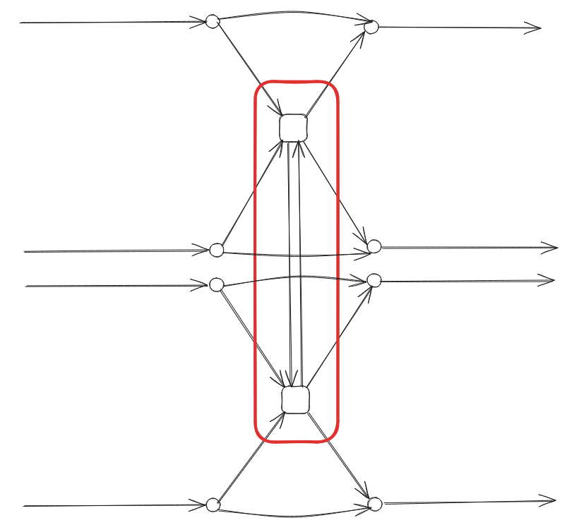
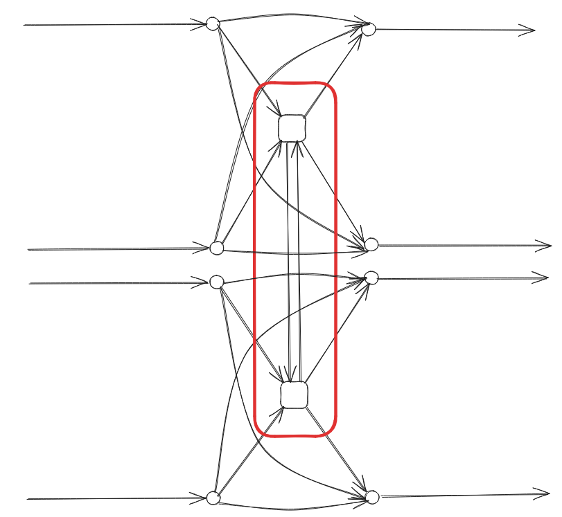
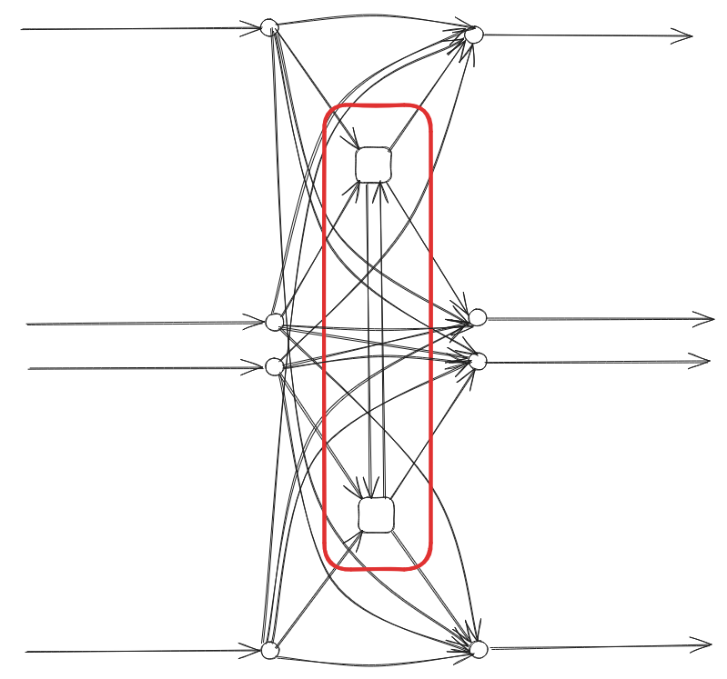

The Transit assignment graph
============================

This page is a description of a graph structure for a *transit network*,
used for *static*, *link-based*, *frequency-based* *assignment*. Our
focus is the classic algorithm “Optimal strategies” by Spiess & Florian
[1]_.

Let’s start by giving a few definitions:

-  *transit* definition from
   `Wikipedia <https://en.wikipedia.org/wiki/Public_transport>`__:

..

   system of transport for passengers by group travel systems available
   for use by the general public unlike private transport, typically
   managed on a schedule, operated on established routes, and that
   charge a posted fee for each trip.

-  *transit network*: a set of transit lines and stops, where passengers
   can board, alight or change vehicles.

-  *assignment*: distribution of the passengers (demand) on the network
   (supply), knowing that transit users attempt to minimize total travel
   time, time or distance walking, time waiting, number of transfers,
   fares, etc…

-  *static* assignment : assignment without time evolution. Dynamic
   properties of the flows, such as congestion, are not well described,
   unlike with dynamic assignment models.

-  *frequency-based* (or *headway-based*) as opposed to schedule-based :
   schedules are averaged in order to get line frequencies. In the
   schedule-based approach, distinct vehicle trips are represented by
   distinct links. We can see the associated network as a time-expanded
   network, where the third dimension would be time.

-  *link-based*: the assignment algorithm is not evaluating paths, or
   any aggregated information besides attributes stored by nodes and
   links. In the present case, each link has an associated cost (travel
   time) *c* [*s*] and frequency *f* [1/*s*].

We are going at first to describe the input transit network, which is
mostly composed of stops, lines and zones.

Elements of a transit network
-----------------------------

Transit stops and stations
~~~~~~~~~~~~~~~~~~~~~~~~~~

Transit stops are points where passenger can board, alight or change
vehicles. Also, they can be part of larger stations:

In the illustration above, two distinct stops, A and B, are highlighted,
both affiliated with the same station (depicted in red).

Transit lines
~~~~~~~~~~~~~

A transit line is a set of services that may use different routes,
decomposed into segments.

Transit routes
^^^^^^^^^^^^^^

A routes is described by a sequence of stop nodes. We assume here the
routes to be directed. For example, we can take a simple case with 3
stops:

In this case, the ``L1`` line is made of two distinct routes: - ABC -
CBA.

Various configurations are possible, such as: 

- a partial route at a given moment of the day: AB, 

- a route with an additional stop : ABDC 

- a route that does not stop at a given stop: AC

Lines can be decomposed into multiple sub-lines, each representing
distinct routes. For the given example, we may have several sub-lines
under the same commercial line (L1):

======= =============== ============= ===========
line id commercial name stop sequence headway (s)
======= =============== ============= ===========
L1_a1   L1              ABC           600
L1_a2   L1              ABDC          3600
L1_a3   L1              AB            3600
L1_a4   L1              AC            3600
L1_b1   L1              CBA           600
======= =============== ============= ===========

Headway, associated with each sub-line, corresponds to the mean time
range between consecutive vehicles—the inverse of the line frequency
used as a link attribute in the assignment algorithm.

Line segments
^^^^^^^^^^^^^

A line segment represents a portion of a transit line between two
consecutive stops. Using the example line ``L1_a1``, we derive two
distinct line segments:

+----------+---------+-------------+-------------------+--------------+
| line id  | segment | origin stop | destination stop  | travel_time  |
|          | index   |             |                   | (s)          |
+==========+=========+=============+===================+==============+
| L1_a1    | 1       | A           | B                 | 300          |
+----------+---------+-------------+-------------------+--------------+
| L1_a1    | 2       | B           | C                 | 600          |
+----------+---------+-------------+-------------------+--------------+

Note that a travel time is included for each line segment, serving as
another link attribute used by the assignment algorithm.

Note that a travel time is included for each line segment, serving as
another link attribute used by the assignment algorithm.

Transit assignment zones and connectors
---------------------------------------

To effectively assign passengers on the network, expressing demand
between regions is crucial. This is achieved by first decomposing the
network area into a partition of transit assignment zones, as
illustrated below with 4 non-overlapping zones:

The demand is then expressed as a number of trips from each zone to every other zone, forming a 4 by 4 Origin/Destination (OD) matrix in this case.

Additionally, each zone centroid is connected to specific network nodes to facilitate the connection between supply and demand. These connection points are referred to as *connectors*.

.. image:: ../../images/transit_graph_connectors.png
   :width: 400
   :align: center
   :alt: transit connectors

With these components, we now have all the elements required to describe the assignment graph.

The Assignment graph
--------------------

Link and node types
~~~~~~~~~~~~~~~~~~~

The transit network is used to generate a graph with specific nodes and
links used to model the transit process. Various link types and node
categories play crucial roles in this representation.

| **Link types:**

- *on-board* 

- *boarding* 

- *alighting* 

- *dwell* 

- *transfer* 

- *connector* 

- *walking*

| **Nodes types:**

- *stop* 

- *boarding* 

- *alighting* 

- *od* 

- *walking*

To illustrate, consider the anatomy of a simple stop:

Waiting links encompass *boarding* and *transfer* links. Each line
segment is associated with a *boarding*, an *on-board* and an
*alighting* link.

*Transfer* links enable to compute the passenger flow count between line
couples at the same stop:

.. image:: ../../images/transit_graph_transfer_links.png
   :width: 500
   :align: center
   :alt: transfer links

These links can be extended between all lines of a station if an increase in the number of links is viable.

*walking* links connect *stop* nodes within a station, while *connector* links connect the zone centroids (*od* nodes) to *stop* nodes:

Connectors that connect *od* to *stop* nodes allow passengers to access the network, while connectors in the opposite direction allow them to egress. Walking nodes/links may also be used to connect stops from distant stations.

Link attributes
~~~~~~~~~~~~~~~

The table below summarizes link characteristics and attributes based on
link types:

+-------------+------------------+----------------+------------+------------------+
| link type   | from node type   | to node type   | cost       | frequency        |
+=============+==================+================+============+==================+
| *on-board*  | *boarding*       | *alighting*    | trav. time | :math:`\infty`   |
+-------------+------------------+----------------+------------+------------------+
| *boarding*  | *stop*           | *boarding*     | const.     | line freq.       |
+-------------+------------------+----------------+------------+------------------+
| *alighting* | *alighting*      | *stop*         | const.     | :math:`\infty`   |
+-------------+------------------+----------------+------------+------------------+
| *dwell*     | *alighting*      | *boarding*     | const.     | :math:`\infty`   |
+-------------+------------------+----------------+------------+------------------+
| *transfer*  | *alighting*      | *boarding*     | const. +   | dest. line freq. |
|             |                  |                | trav. time |                  |
+-------------+------------------+----------------+------------+------------------+
| *connector* | *od* or *stop*   | *od* or *stop* | trav. time | :math:`\infty`   |
+-------------+------------------+----------------+------------+------------------+
| *walking*   | *stop* or        | *stop* or      | trav. time | :math:`\infty`   |
|             | *walking*        | *walking*      |            |                  |
+-------------+------------------+----------------+------------+------------------+

The travel time is specific to each line segment or walking time. For
example, there can be 10 minutes connection between stops in a large
transit station. Constant boarding and alighting times are applied
uniformly across the network, and *dwell* links have constant cost equal
to the sum of the alighting and boarding constants.

Additional attributes can be introduced for specific link types, such
as: 

- *line_id*: for *on-board*, *boarding*, *alighting* and *dwell* links. 

- *line_seg_idx*: the line segment index for *boarding*, *on-board* and *alighting* links. 

- *stop_id*: for *alighting*, *dwell* and *boarding* links. This can also apply to *transfer* links for inner stop transfers. 

- *o_line_id*: origin line id for *transfer* links 

- *d_line_id*: destination line id for *transfer* links

In the next section, we will explore a small classic transit network
example featuring four stops and four lines.

A Small example : Spiess and Florian
------------------------------------

This illustrative example is taken from *Spiess and Florian* [1]_:

.. image:: ../../images/transit_graph_spiess_florian_1.png
   :width: 600
   :align: center
   :alt: Spiess Florian 1

Travel time are indicated on the figure. We have the following four distinct line characteristics:

+-------+------+-------------+-----------------+
|line id| route|headway (min)| frequency (1/s) |
+=======+======+=============+=================+
| L1    |  AB  |          12 |     0.001388889 |
+-------+------+-------------+-----------------+
| L2    | AXY  |          12 |     0.001388889 |
+-------+------+-------------+-----------------+
| L3    | XYB  |          30 |     0.000555556 |
+-------+------+-------------+-----------------+
| L4    |  YB  |           6 |     0.002777778 |
+-------+------+-------------+-----------------+

Passengers aim to travel from A to B, prompting the division of the network area into two distinct zones: TAZ 1 and TAZ 2. The assignment graph associated with this network encompasses 26 links:

Here is a table listing all links :

+---------+-----------+---------+------+--------------+
| link id | link type | line id | cost |    frequency |
+=========+===========+=========+======+==============+
|       1 |*connector*|         |    0 |:math:`\infty`|
+---------+-----------+---------+------+--------------+
|       2 | *boarding*|      L1 |    0 |  0.001388889 |
+---------+-----------+---------+------+--------------+
|       3 | *boarding*|      L2 |    0 |  0.001388889 |
+---------+-----------+---------+------+--------------+
|       4 | *on-board*|      L1 | 1500 |:math:`\infty`|
+---------+-----------+---------+------+--------------+
|       5 | *on-board*|      L2 |  420 |:math:`\infty`|
+---------+-----------+---------+------+--------------+
|       6 |*alighting*|      L2 |    0 |:math:`\infty`|
+---------+-----------+---------+------+--------------+
|       7 |    *dwell*|      L2 |    0 |:math:`\infty`|
+---------+-----------+---------+------+--------------+
|       8 | *transfer*|         |    0 |  0.000555556 |
+---------+-----------+---------+------+--------------+
|       9 | *boarding*|      L2 |    0 |  0.001388889 |
+---------+-----------+---------+------+--------------+
|      10 | *boarding*|      L3 |    0 |  0.000555556 |
+---------+-----------+---------+------+--------------+
|      11 | *on-board*|      L2 |  360 |:math:`\infty`|
+---------+-----------+---------+------+--------------+
|      12 | *on-board*|      L3 |  240 |:math:`\infty`|
+---------+-----------+---------+------+--------------+
|      13 |*alighting*|      L3 |    0 |:math:`\infty`|
+---------+-----------+---------+------+--------------+
|      14 |*alighting*|      L2 |    0 |:math:`\infty`|
+---------+-----------+---------+------+--------------+
|      15 | *transfer*|      L3 |    0 |  0.000555556 |
+---------+-----------+---------+------+--------------+
|      16 | *transfer*|         |    0 |  0.002777778 |
+---------+-----------+---------+------+--------------+
|      17 |    *dwell*|      L3 |    0 |:math:`\infty`|
+---------+-----------+---------+------+--------------+
|      18 | *transfer*|         |    0 |  0.002777778 |
+---------+-----------+---------+------+--------------+
|      19 | *boarding*|      L3 |    0 |  0.000555556 |
+---------+-----------+---------+------+--------------+
|      20 | *boarding*|      L4 |    0 |  0.002777778 |
+---------+-----------+---------+------+--------------+
|      21 | *on-board*|      L3 |  240 |:math:`\infty`|
+---------+-----------+---------+------+--------------+
|      22 | *on-board*|      L4 |  600 |:math:`\infty`|
+---------+-----------+---------+------+--------------+
|      23 |*alighting*|      L4 |    0 |:math:`\infty`|
+---------+-----------+---------+------+--------------+
|      24 |*alighting*|      L3 |    0 |:math:`\infty`|
+---------+-----------+---------+------+--------------+
|      25 |*alighting*|      L1 |    0 |:math:`\infty`|
+---------+-----------+---------+------+--------------+
|      26 |*connector*|         |    0 |:math:`\infty`|
+---------+-----------+---------+------+--------------+

Transit graph specificities in AequilibraE
------------------------------------------

The graph creation process in AequilibraE incorporates several edge types to capture the nuances of transit networks. Notable distinctions include:

**Connectors :**  

- *access connectors* directed from od nodes to the network   

- *egress connectors* directed from the network to the od nodes  

**Transfer edges :**

- *inner transfer*: Connect lines within the same stop  

- *outer transfer*: Connect lines between distinct stops within the same station  

**Origin and Destination Nodes :**  

- *origin* nodes: represent the starting point of passenger trips

- *destination* nodes: represent the end point of passenger trips

Users can customize these features using boolean parameters:

- `with_walking_edges`: create walking edges between the stops of a station

- `with_inner_stop_transfers`: create transfer edges between lines of a stop

- `with_outer_stop_transfers`: create transfer edges between lines of different stops of a station

- `blocking_centroid_flow`: duplicate OD nodes into unconnected origin and destination nodes in order to block centroid flows. Flows starts from an origin node and ends at a destination node. It is not possible to use an egress connector followed by an access connector in the middle of a trip.

Note that during the assignment, if passengers have the choice between a transfer edge or a walking edge for a line change, they will always be assigned to the transfer edge.

This leads to these possible edge types:

- on-board

- boarding

- alighting

- dwell

- access_connector

- egress_connector

- inner_transfer

- outer_transfer

- walking

Here is a simple example of a station with two stops, with two lines each:

- walking edges only:

- inner transfer edges, but no outer transfer ones:

- both inner and outer transfer edges:

As an illustrative example, if we build the graph for the city of Lyon France (GTFS files from 2022) on a given day, we get 20196 vertices and 91107 edges, with
``with_walking_edges=True``, ``with_inner_stop_transfers=True``,
``with_outer_stop_transfers=True`` and ``blocking_centroid_flow=False``.
Here is the distribution of edge types:

================ =====
Edge type        Count
================ =====
outer_transfer   27287
inner_transfer   10721
walking          9140
on-board         7590
boarding         7590
alighting        7590
dwell            7231
access_connector 6979
egress_connector 6979
================ =====

and vertex types:

=========== =====
Vertex type Count
=========== =====
alighting   7590
boarding    7590
stop        4499
od          517
=========== =====

References
----------

.. [1] Spiess, H., Florian, M. (1989) "Optimal strategies: A new assignment model for transit networks". 
       Transportation Research Part B: Methodological, 23(2), 83-102. 
       Available in: https://doi.org/10.1016/0191-2615(89)90034-9
