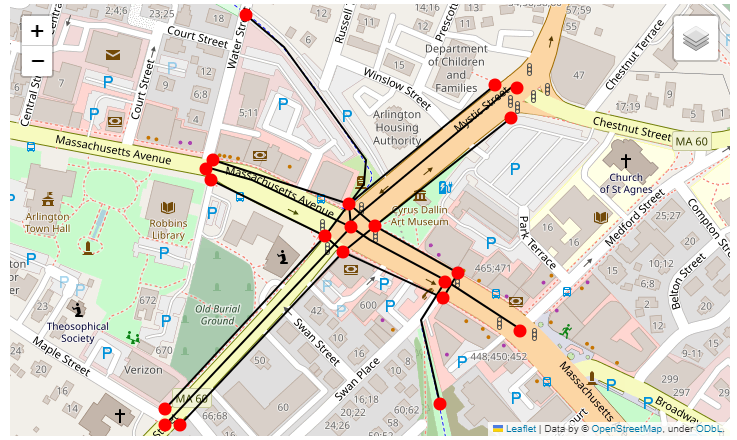
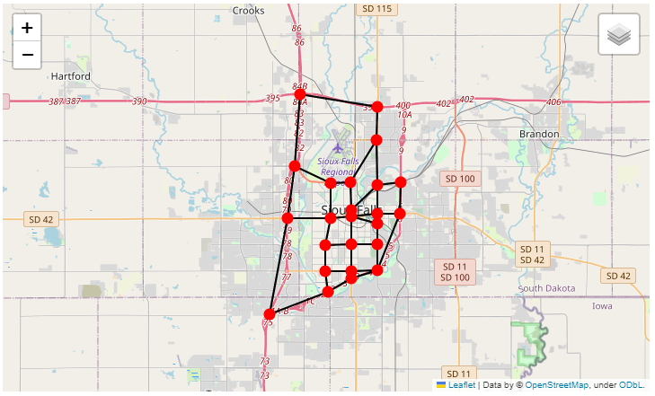

.. _net_manipulation:

Network manipulation
--------------------

Importing and exporting the network
~~~~~~~~~~~~~~~~~~~~~~~~~~~~~~~~~~~

Currently AequilibraE can import links and nodes from a network from OpenStreetMaps, 
GMNS, and from link layers. AequilibraE can also export the existing network
into GMNS format. There is some valuable information on these topics in the following
sections.

.. _importing_from_osm:

Importing from OpenStreetMap
^^^^^^^^^^^^^^^^^^^^^^^^^^^^

You can check more specifications on OSM download on the :ref:`parameters_file`.

.. note::

   All links that cannot be imported due to errors in the SQL insert
   statements are written to the log file with error message AND the SQL
   statement itself, and therefore errors in import can be analyzed for
   re-downloading or fixed by re-running the failed SQL statements after
   manual fixing.

Python limitations
++++++++++++++++++

As it happens in other cases, Python's usual implementation of SQLite is
incomplete, and does not include R-Tree, a key extension used by SpatiaLite for
GIS operations.

If you want to learn a little more about this topic, you can access this
`blog post <https://pythongisandstuff.wordpress.com/2015/11/11/python-and-spatialite-32-bit-on-64-bit-windows/>`_
or check out the SQLite page on `R-Tree <https://www.sqlite.org/rtree.html>`_.

This limitation issue is solved when installing SpatiaLite, as shown
in :ref:`the dependencies page <installing_spatialite>`.

Please also note that AequilibraE's network consistency triggers **will NOT work** 
before spatial indices have been created and/or if the editing is being done on a
platform that does not support both R-Tree and SpatiaLite.

.. seealso::

    * :func:`aequilibrae.project.Network.create_from_osm`
        Function documentation
    * :ref:`plot_from_osm`
        Usage example

Importing from link layer
^^^^^^^^^^^^^^^^^^^^^^^^^

It is possible to create an AequilibraE project from a link layer, such as a \*.csv file that
contains geometry in WKT, for instance. You can check an example with all functions used in
:ref:`the following example <project_from_link_layer>`.

.. _importing_from_gmns_file:

Importing from files in GMNS format
^^^^^^^^^^^^^^^^^^^^^^^^^^^^^^^^^^^

Before importing a network from a source in GMNS format, it is imperative to know 
in which spatial reference its geometries (links and nodes) were created. If the SRID
is different than 4326, it must be passed as an input using the argument ``srid``.

It is possible to import the following files from a GMNS source:

* link table;
* node table;
* use_group table;
* geometry table.

You can find the specification for all these tables in the GMNS documentation, 
`here <https://github.com/zephyr-data-specs/GMNS/tree/develop/docs/spec>`_.

By default, the method ``create_from_gmns()`` read all required and optional fields
specified in the GMNS link and node tables specification. If you need it to read 
any additional fields as well, you have to modify the AequilibraE parameters as
shown in the :ref:`example <import_from_gmns>`.

When adding a new field to be read in the parameters.yml file, it is important to 
keep the "required" key set to False, since you will always be adding a non-required 
field. Required fields for a specific table are only those defined in the GMNS
specification.

.. note::

    In the AequilibraE nodes table, if a node is to be identified as a centroid, its
    'is_centroid' field has to be set to 1. However, this is not part of the GMNS
    specification. Thus, if you want a node to be identified as a centroid during the
    import process, in the GMNS node table you have to set the field 'node_type' equals
    to 'centroid'.

.. seealso::

    * :func:`aequilibrae.project.Network.create_from_gmns`
        Function documentation
    * :ref:`import_from_gmns`
        Usage example

.. _aequilibrae_to_gmns:

Exporting AequilibraE model to GMNS format
^^^^^^^^^^^^^^^^^^^^^^^^^^^^^^^^^^^^^^^^^^

After loading an existing AequilibraE project, you can export it to GMNS format. 

It is possible to export an AequilibraE network to the following tables in GMNS format:

* link table
* node table
* use_definition table

This list does not include the optional 'use_group' table, which is an optional argument
of the GMNS function, because mode groups are not used in the AequilibraE modes table.

In addition to all GMNS required fields for each of the three exported tables, some
other fields are also added as reminder of where the features came from when looking 
back at the AequilibraE project.

.. note::

    When a node is identified as a centroid in the AequilibraE nodes table, this
    information is transmitted to the GMNS node table by means of the field
    'node_type', which is set to 'centroid' in this case. The 'node_type' field
    is an optinal field listed in the GMNS node table specification.

You can find the GMNS specification
`here <https://github.com/zephyr-data-specs/GMNS/tree/develop/docs/spec>`_.

.. seealso::

    * :func:`aequilibrae.project.Network.export_to_gmns`
        Function documentation
    * :ref:`export_to_gmns`
        Usage example

Dealing with Geometries
~~~~~~~~~~~~~~~~~~~~~~~

Geometry is a key feature when dealing with transportation infrastructure and
actual travel. For this reason, all datasets in AequilibraE that correspond to
elements with physical GIS representation, links and nodes in particular, are
geo-enabled.

This also means that the AequilibraE API needs to provide an interface to
manipulate each element's geometry in a convenient way. This is done using the
standard `Shapely <https://shapely.readthedocs.io/>`_, and we urge you to study
its comprehensive API before attempting to edit a feature's geometry in memory.

As we mentioned in other sections of the documentation, the user is also welcome
to use its powerful tools to manipulate your model's geometries, although that
is not recommended, as the "training wheels are off".

Data consistency
^^^^^^^^^^^^^^^^

Data consistency is not achieved as a monolithic piece, but rather through the
*treatment* of specific changes to each aspect of all the objects being
considered (i.e. nodes and links) and the expected consequence to other
tables/elements. To this effect, AequilibraE has triggers covering a
comprehensive set of possible operations for links and nodes, covering both
spatial and tabular aspects of the data.

Although the behaviour of these trigger is expected to be mostly intuitive
to anybody used to editing transportation networks within commercial modeling
platforms, we have detailed the behaviour for all different network changes.

This implementation choice is not, however, free of caveats. Due to
technological limitations of SQLite, some of the desired behaviors identified
cannot be implemented, but such caveats do not impact the
usefulness of this implementation or its robustness in face of minimally careful
use of the tool.

.. note::
  This documentation, as well as the SQL code it referes to, comes from the
  seminal work done in `TranspoNet <http://github.com/AequilibraE/TranspoNet/>`_
  by `Pedro <https://au.linkedin.com/in/pedrocamargo>`_ and
  `Andrew <https://au.linkedin.com/in/andrew-o-brien-5a8bb486>`_.

Network consistency behaviour
^^^^^^^^^^^^^^^^^^^^^^^^^^^^^

In order for the implementation of this standard to be successful, it is
necessary to map all the possible user-driven changes to the underlying data and
the behavior the SQLite database needs to demonstrate in order to maintain
consistency of the data. The detailed expected behavior is detailed below.
As each item in the network is edited, a series of checks and changes to other
components are necessary in order to keep the network as a whole consistent. In
this section we list all the possible physical (geometrical) changes to each
element of the network and what behavior (consequences) we expect from each one
of these changes.

Our implementation, in the form of a SQLite database, will be referred to as
network from this point on.

Ensuring data consistency as each portion of the data is edited is a two part
problem:

1. Knowing what to do when a certain edit is attempted by the user
2. Automatically applying the tests and consistency checks (and changes)
   required on one

The table below presents all meaningful operations that a user
can do to links and nodes, and you can use the table below to navigate between
each of the changes to see how they are treated through triggers.

.. table::
   :width: 60%
   :align: center

   +-------------------------------+----------------------------------+--------------------------+
   | Nodes                         | Links                            | Fields                   |
   +===============================+==================================+==========================+
   | :ref:`creating_a_node`        | :ref:`deleting_a_link`           | :ref:`link_distance`     |
   +-------------------------------+----------------------------------+--------------------------+
   | :ref:`deleting_a_node`        | :ref:`moving_a_link_extremity`   | :ref:`link_direction`    |
   +-------------------------------+----------------------------------+--------------------------+
   | :ref:`moving_a_node`          | :ref:`reshaping_a_link`          | :ref:`modes_field`       |
   +-------------------------------+----------------------------------+--------------------------+
   | :ref:`adding_a_data_field`    | :ref:`deleting_a_required_field` | :ref:`link_type_fields`  |
   +-------------------------------+----------------------------------+--------------------------+
   | :ref:`deleting_a_data_field`  |                                  | :ref:`a_node_and_b_node` |
   +-------------------------------+----------------------------------+--------------------------+
   | :ref:`modifying_a_data_entry` |                                  |                          |
   +-------------------------------+----------------------------------+--------------------------+

.. _modifications_on_nodes_layer:

Node layer changes and expected behavior
++++++++++++++++++++++++++++++++++++++++

There are 6 possible changes envisioned for the network nodes layer, being 3 of
geographic nature and 3 of data-only nature. The possible variations for each
change are also discussed, and all the points where alternative behavior is
conceivable are also explored.

.. _creating_a_node:

Creating a node
'''''''''''''''

There are only three situations when a node is to be created:

- Placement of a link extremity (new or moved) at a position where no node already exists
- Splitting a link in the middle
- Creation of a centroid for later connection to the network

In all cases a unique node ID needs to be generated for the new node, and all
other node fields should be empty.

An alternative behavior would be to allow the user to create nodes with no
attached links. Although this would not result in inconsistent networks for
traffic and transit assignments, this behavior would not be considered valid.
All other edits that result in the creation of unconnected nodes or that result
in such case should result in an error that prevents such operation

Behavior regarding the fields regarding modes and link types is discussed in
their respective table descriptions

.. _deleting_a_node:

Deleting a node
'''''''''''''''

Deleting a node is only allowed in two situations:

- No link is connected to such node (in this case, the deletion of the node
  should be handled automatically when no link is left connected to such node)
- When only two links are connected to such node. In this case, those two links
  will be merged, and a standard operation for computing the value of each field
  will be applied.

For simplicity, the operations are: Weighted average for all numeric fields,
copying the fields from the longest link for all non-numeric fields. Length is
to be recomputed in the native distance measure of distance for the projection
being used.

A node can only be eliminated as a consequence of all links that terminated/
originated at it being eliminated. If the user tries to delete a node, the
network should return an error and not perform such operation.

Behavior regarding the fields regarding modes and link types is discussed in
their respective table descriptions

.. _moving_a_node:

Moving a node
'''''''''''''

There are two possibilities for moving a node: moving to an empty space, and
moving on top of another node.

- If a node is moved to an empty space, all links originated/ending at that node will 
  have its shape altered to conform to that new node position and keep the network 
  connected. The alteration of the link happens only by changing the latitude and 
  longitude of the link extremity associated with that node.
- If a node is moved on top of another node, all the links that connected to the node 
  on the bottom have their extremities switched to the node on top. The node on the 
  bottom gets eliminated as a consequence of the behavior listed on :ref:`deleting_a_node`.

Behavior regarding the fields related to modes and link types is discussed in
their respective table descriptions.

.. seealso::

      * :ref:`Editing network nodes <editing_network_nodes>`
         Usage example

.. _adding_a_data_field:

Adding a data field
'''''''''''''''''''

No consistency check is needed other than ensuring that no repeated data field
names exist.

.. _deleting_a_data_field:

Deleting a data field
'''''''''''''''''''''

If the data field whose attempted deletion is mandatory, the network should
return an error and not perform such operation. Otherwise the operation can be
performed.

.. _modifying_a_data_entry:

Modifying a data entry
''''''''''''''''''''''

If the field being edited is the node_id field, then all the related tables need
to be edited as well (e.g. a_b and b_node in the link layer, the node_id tagged
to turn restrictions and to transit stops).

.. _modifications_on_links_layer:

Link layer changes and expected behavior
++++++++++++++++++++++++++++++++++++++++

Network links layer also has some possible changes of geographic and data-only nature.

.. _deleting_a_link:

Deleting a link
'''''''''''''''

In case a link is deleted, it is necessary to check for orphan nodes, and deal
with them as prescribed in :ref:`deleting_a_node`. In case one of the link
extremities is a centroid (i.e. field ``is_centroid=1``), then the node should not
be deleted even if orphaned.

Behavior regarding the fields regarding modes and link types is discussed in
their respective table descriptions.

.. _moving_a_link_extremity:

Moving a link extremity
'''''''''''''''''''''''

This change can happen in two different forms:

- The link extremity is moved to an empty space - 
  In this case, a new node needs to be created, according to the behavior
  described in :ref:`creating_a_node`. The information of node ID (A or B
  node, depending on the extremity) needs to be updated according to the ID for
  the new node created.

- The link extremity is moved from one node to another - 
  The information of node ID (A or B node, depending on the extremity) needs to be
  updated according to the ID for the node the link now terminates in.
  Behavior regarding the fields regarding modes and link types is discussed in
  their respective table descriptions.

.. seealso::
    
    * :ref:`Editing network links <editing_network_links>`
       Usage example

.. _reshaping_a_link:

Re-shaping a link
'''''''''''''''''

When reshaping a link, the only thing other than we expect to be updated in the
link database is their length (or distance, in AequilibraE's field structure).
As of now, distance in AequilibraE is **ALWAYS** measured in meters.

.. seealso::

    * :ref:`Splitting network links <editing_network_splitting_link>`
       Usage example

.. _deleting_a_required_field:

Deleting a required field
'''''''''''''''''''''''''

Unfortunately, SQLite does not have the resources to prevent a user to remove a
data field from the table. For this reason, if the user removes a required
field, they will most likely corrupt the project.

Field-specific data consistency
+++++++++++++++++++++++++++++++

Some data fields are specially sensitive to user changes.

.. _link_distance:

Link distance
'''''''''''''

Link distance cannot be changed by the user, as it is automatically recalculated
using the SpatiaLite function ``GeodesicLength``, which always returns distances
in meters.

.. _link_direction:

Link direction
'''''''''''''''

Triggers enforce link direction to be -1, 0 or 1, and any other value results in an SQL exception.

.. _modes_field:

Field 'modes' (links and nodes layers)
''''''''''''''''''''''''''''''''''''''

A series of triggers are associated with the modes field, and they are all described in the :ref:`tables_modes`.

.. _link_type_fields:

Fields 'link_type' (links layer) & 'link_types' (nodes layer)
'''''''''''''''''''''''''''''''''''''''''''''''''''''''''''''

A series of triggers are associated with the modes field, and they are all described in the :ref:`tables_link_types`.

.. _a_node_and_b_node:

Fields 'a_node' and 'b_node'
''''''''''''''''''''''''''''

The user should not change the a_node and b_node fields, as they are controlled
by the triggers that govern the consistency between links and nodes. It is not
possible to enforce that users do not change these two fields, as it is not
possible to choose the trigger application sequence in SQLite

.. toctree::
   :hidden:
   :maxdepth: 1

   network_manipulation/_auto_examples/index
