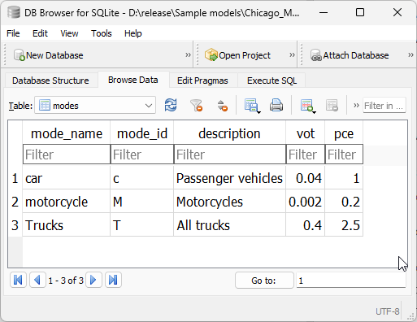

.. _project_tables:

==============
Project Tables
==============

The tables included in the project are those required for traditional model
development, and are always required unless explicitly mentioned otherwise.

.. _tables_section6.1:

Modes table
~~~~~~~~~~

The **modes** table exists to list all the modes available in the model's network,
and its main role is to support the creation of graphs directly from the SQLite
project.

The modes table has three fields, being the *mode_name*, *description* and
*mode_id*, where *mode_id* is a single letter that is used to codify mode
permissions in the network, as further discussed in :ref:`network`.

An example of what the contents of the mode table look like is below:

Consistency triggers
--------------------
As it happens with the links and nodes table (:ref:`network_triggers_behaviour`),
the modes table is kept consistent with the links table through the use of
database triggers

.. _tables_section6.1.1.1:

Changing the modes allowed in a certain link
^^^^^^^^^^^^^^^^^^^^^^^^^^^^^^^^^^^^^^^^^^^^

Whenever we change the modes allowed on a link, we need to check for two
conditions:

* At least one mode is allowed on that link
* All links allowed on that link exist in the modes table

For each condition, a specific trigger was built, and if any of the checks
fails, the transaction will fail.

.. _tables_section6.1.1.2:

Adding a new link
^^^^^^^^^^^^^^^^^
The exact same behaviour as for :ref:`tables_section6.1.1.1` applies in this
case, but it requires specific new triggers on the **creation** of the link.

.. _tables_section6.1.1.3:

Editing a mode in the modes table
^^^^^^^^^^^^^^^^^^^^^^^^^^^^^^^^^
Whenever we want to edit a mode in the modes table, we need to check for two
conditions:

* The new mode_id is exactly one character long
* The old mode_id is not still in use on the network

For each condition, a specific trigger was built, and if any of the checks
fails, the transaction will fail.

The requirements for uniqueness and non-absent values are guaranteed during the
construction of the modes table by using the keys **UNIQUE** and **NOT NULL**.

.. _tables_section6.1.1.4:

Adding a new mode to the modes table
^^^^^^^^^^^^^^^^^^^^^^^^^^^^^^^^^^^^
In this case, only the first behaviour mentioned above on
:ref:`tables_section6.1.1.3` applies, the verification that the mode_id is
exactly one character long. Therefore only one new trigger is required.

.. _tables_section6.1.1.5:

Removing a mode from the modes table
^^^^^^^^^^^^^^^^^^^^^^^^^^^^^^^^^^^^

In counterpoint, only the second behaviour mentioned above on
:ref:`tables_section6.1.1.3` applies in this case, the verification that the old
mode_id is not still in use by the network. Therefore only one new trigger is
required.

.. _tables_section6.2:

Link types table
~~~~~~~~~~~~~~~~

The **link_types** table exists to list all the link types available in the
model's network, and its main role is to support processes such as adding
centroids and centroid connectors and to store reference data like default
lane capacity for each link type.

.. _tables_section6.2.1:

Basic fields
------------

The modes table has five main fields, being the *link_type*, *link_type_id*,
*description*, *lanes* and *lane_capacity*. Of these fields, the only mandatory
ones are *link_type* and *link_type_id*, where the former appears in the
link_table on the field *link_type*, while the latter is a single character that
can be concatenated into the *nodes*** layer to identify the link_types that
connect into each node.

.. _tables_section6.2.2:

Additional fields
-----------------

This table also has ten other fields named after the greek letters
*alpha, beta, gamma, delta, epsilon, zeta, iota, sigma, phi* and *tau*.
These fields are all numeric and exist to allow the user to store additional
data related to link types (e.g. parameters for Volume-Delay functions).

Descriptions of these fields can be included in the *link_types_attributes*
table for the user's convenience.

.. _tables_section6.2.3:

Reserved values
---------------
There are two default link types in the link_types table and that cannot be
removed from the model without breaking it.

- **centroid_connector** - These are **VIRTUAL** links added to the network with
  the sole purpose of loading demand/traffic onto the network. The identifying
  letter for this mode is **z**.

- **default** - This link type exists to facilitate the creation of networks
  when link types are irrelevant. The identifying letter for this mode is **y**.
  That is right, you have from a to x to create your own link types. :-D

.. _tables_section6.2.4:

Adding new link_types
---------------------

To manually add link types, the user can add further link types to the
parameters file, as shown below.

.. image:: images/parameters_link_types.png
    :width: 1122
    :align: center
    :alt: Link type specification

To add new link types programatically, one can do the following

::

  from aequilibrae import Parameters
  par = Parameters()

  new_type = {'collector': {'description': 'Regular collector street',
                            'link_type_id': 'c',
                            'lanes': 1,
                            'lane_capacity': 600}}

  par.parameters["network"]["links"]["link_types"].append(new_type)
  par.write_back()

.. note::
   AequilibraE will not block you from adding new link types to the
   parameters file if those parameters are wrong. It is your responsibility
   to ensure that completeness, uniqueness and formatting requirements are
   followed.

.. _tables_section6.2.5:

Consistency triggers
--------------------
As it happens with the links and nodes tables,
(:ref:`network_triggers_behaviour`), the link_types table is kept consistent
with the links table through the use of database triggers

.. _tables_section6.2.5.1:

Changing the link_type for a certain link
^^^^^^^^^^^^^^^^^^^^^^^^^^^^^^^^^^^^^^^^^

Whenever we change the link_type associated to a link, we need to check whether
that link type exists in the links_table.

This condition is ensured by specific trigger checking whether the new link_type 
exists in the link table. If if it does not, the transaction will fail.

.. _tables_section6.2.5.2:

Adding a new link
^^^^^^^^^^^^^^^^^
The exact same behaviour as for :ref:`tables_section6.2.5.1` applies in this
case, but it requires an specific trigger on the **creation** of the link.

.. _tables_section6.2.5.3:

Editing a link_type in the link_types table
^^^^^^^^^^^^^^^^^^^^^^^^^^^^^^^^^^^^^^^^^^^
Whenever we want to edit a link_type in the link_types table, we need to check for 
two conditions:

* The new link_type_id is exactly one character long
* The old link_type is not still in use on the network

For each condition, a specific trigger was built, and if any of the checks
fails, the transaction will fail.

The requirements for uniqueness and non-absent values are guaranteed during the
construction of the modes table by using the keys **UNIQUE** and **NOT NULL**.

.. _tables_section6.2.5.4:

Adding a new link_type to the link_types table
^^^^^^^^^^^^^^^^^^^^^^^^^^^^^^^^^^^^^^^^^^^^^^
In this case, only the first behaviour mentioned above on
:ref:`tables_section6.2.5.3` applies, the verification that the link_type_id is
exactly one character long. Therefore only one new trigger is required.

.. _tables_section6.2.5.5:

Removing a link_type from the link_types table
^^^^^^^^^^^^^^^^^^^^^^^^^^^^^^^^^^^^^^^^^^^^^^

In counterpoint, only the second behaviour mentioned above on
:ref:`tables_section6.2.5.3` applies in this case, the verification that the old
link_type is not still in use by the network. Therefore only one new trigger is
required.

