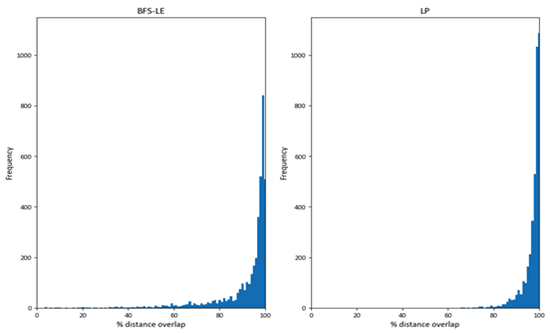

Route Choice
============

The route choice problem does not have a closed solution, and the selection of one of the many
existing frameworks for solution depends on many factors [1]_ [2]_. A common modelling framework 
in practice consists of two steps: choice set generation and the choice selection process.

AequilibraE is the first modeling package with full support for route choice, from the creation of 
choice sets through multiple algorithms to the assignment of trips to the network using the 
traditional path-size logit.

Choice set generation
---------------------

Consistent with AequilibraE's software architecture, the route choice set generation is implemented 
as a separate Cython module that integrates into existing AequilibraE infrastructure; this allows 
it to benefit from established optimisations such as graph compression and high-performance data 
structures.

A key point of difference in AequilibraE's implementation comes from its flexibility in allowing us 
to reconstruct a compressed graph for computation between any two points in the network. This is a 
significant advantage when preparing datasets for model estimation, as it is possible to generate 
choice sets between exact network positions collected from observed data (e.g. vehicle GPS data, 
location-based services, etc.), which is especially relevant in the context of micro-mobility and 
active modes.

There are two different route choice set generation algorithms available in AequilibraE: Link 
Penalisation (LP), and Breadth-First Search with Link-Elimination (BFS-LE). The underlying 
implementation relies on the use of several specialized data structures to minimise the overhead 
of route set generation and storage, as both methods were implemented in Cython for easy access 
to existing AequilibraE methods and standard C++ data structures.

The process is designed to run multiple calculations simultaneously across the origin-destination 
pairs, utilising multi-core processors and improving computational performance. As Rieser-Schüssler 
*et al.* (2012)[1]_ noted, pathfinding is the most time-consuming stage in generating a set of route 
choices. Despite the optimisations implemented to reduce the computational load of maintaining the 
route set generation overhead, computational time is still not trivial, as pathfinding remains the 
dominant factor in determining runtime.

Link-Penalization
~~~~~~~~~~~~~~~~~

The link Penalization (LP) method is one of the most traditional approaches for generating route 
choice sets. It consists of an iterative approach where, in each iteration, the shortest path 
between the origin and the destination in question is computed. After each iteration, however, a 
pre-defined penalty factor is applied to all links that are part of the path found, essentially 
modifying the graph to make the previously found path less attractive.

The LP method is a simple and effective way to generate route choice sets, but it is sensitive to 
the penalty factor, which can significantly affect the quality of the generated choice sets, 
requiring experimentation during the model development/estimation stage.

The overhead of the LP method is negligible due to AequilibraE's internal data structures that 
allow for easy data manipulation of the graph in memory.

BFS-LE
~~~~~~

At a high level, BFS-LE operates on a graph of graphs, exploring unique graphs linked by a single 
removed edge. Each graph can be uniquely categorised by a set of removed links from a common 
base graph, allowing us to avoid explicitly maintaining the graph of graphs. Instead, generating 
and storing that graph's set of removed links in the breadth-first search (BFS) order.

To efficiently store and determine the uniqueness of a new route or removed link sets, we used 
modified hash functions with properties that allowed us to store and nest them within standard 
C++ data structures. We used a commutative hash function for the removed link sets to allow for 
amortised :math:`O(1)` order-independent uniqueness testing. While the removed link sets are 
always constructed incrementally, we did not opt for an incremental hash function as we did not 
deem this a worthwhile optimisation. The removed link sets rarely grew larger than double digits, 
even on a network with over 600,000 directed links. This may be an area worth exploring for 
networks with a significantly larger number of desired routes than links between ODs.

For uniqueness testing of discovered routes, AequilibraE implements a traditional, non-commutative 
hash function. Since cryptographic security was not a requirement for our purposes, we use a fast 
general-purpose integer hash function. Further research could explore the use of specialised integer 
vector hash functions. As we did not find the hashing had a non-negligible influence on the runtime 
performance, this optimisation was not tested.

AequilibraE also implements a combination of LP and BFS-LP as an optional feature to the latter 
algorithm, as recommended by Rieser-Schüssler *et al.* (2012) [1]_, which is also a reference for 
further  details on the BFS-LE algorithm.

Comparative experiment
~~~~~~~~~~~~~~~~~~~~~~

In an experiment with nearly 9,000 observed vehicle GPS routes covering a large Australian State, 
we found that all three algorithms (LP, BFS-LE, and BFS-LE+LP) had excellent performance in 
reproducing the observed routes. However, the computational overhead of BFS-LE is substantial 
enough to recommend always verifying if LP is fit-for-purpose.

Path-size logit (PSL)
---------------------

Path-size logit is based on the multinomial logit (MNL) model, which is one of the most used models 
in the transportation field in general [3]_. It can be derived from random utility-maximizing 
principles with certain assumptions on the distribution of the random part of the utility. To
account for the correlation of alternatives, Ramming (2002) [4]_ introduced a correction factor 
that measures the overlap of each route with all other routes in a choice set based on shared 
link attributes, which gives rise to the PSL model. The PSL is currently the most used route 
choice model in practice, hence its choice as the first algorithm to be implemented in AequilibraE.

The PSL model’s utility function is defined by:

.. math:: U_{i} = V_{i} + \beta_{PSL} \times \log{\gamma_i} + \varepsilon_{i}

with path overlap correction factor:

.. math:: \gamma_i = \sum_{a \in A_i} \frac{l_a}{L_i} \times \frac{1}{\sum_{k \in R} \delta_{a,k}}

Here, :math:`U_i` is the total utility of alternative :math:`i`, :math:`V_i` is the observed utility,
:math:`\varepsilon_i` is an identical and independently distributed random variable with a Gumbel 
distribution, :math:`\delta_{a,k}` is the Kronecker delta, :math:`l_a` is cost of link 
:math:`a`, :math:`L_i` is total cost of route :math:`i`, :math:`A_i` is the link set and :math:`R` 
is the route choice set for individual :math:`j` (index :math:`j` suppressed for readability). The 
path overlap correction factor :math:`\gamma` can be theoretically derived by aggregation of 
alternatives under certain assumptions, see [5]_ and references therein.

Notice that AequilibraE's path computation procedures require all link costs to be positive. For 
that reason, link utilities (or disutilities) must be positive, while its obvious minus sign is 
handled internally. This mechanism prevents the possibility of links with actual positive utility, 
but those cases are arguably not reasonable to exist in practice.

.. important::

    **AequilibraE uses cost to compute path overlaps rather than distance.**

Binary logit filter
~~~~~~~~~~~~~~~~~~~

A binary logit filter is available to remove unfavourable routes from the route set before applying
the path-sized logit assignment. This filters accepts a numerical parameter for the minimum demand 
share acceptable for any path, which is approximated by the binary logit considering the shortest 
path and each subsequent path.

Full process overview
---------------------

The estimation of route choice models based on vehicle GPS data can be explored on a family of papers 
scheduled to be presented at the ATRF 2024 [2]_ [6]_ [7]_.

References
----------

.. [1] Rieser-Schüssler, N., Balmer, M., and Axhausen, K.W. (2012). Route choice sets for very 
       high-resolution data. Transportmetrica A: Transport Science, 9(9), 825–845.
       https://doi.org/10.1080/18128602.2012.671383

.. [2] Zill, J.C. and Camargo, P.V. (2024) State-Wide Route Choice Models.
       Presented at the ATRF, Melbourne, Australia.

.. [3] Ben-Akiva, M., and Lerman, S. (1985) Discrete Choice Analysis. The MIT Press.

.. [4] Ramming, M.S. (2002) Network Knowledge and Route Choice. Massachusetts Institute of Technology.
       Available at: https://dspace.mit.edu/bitstream/handle/1721.1/49797/50436022-MIT.pdf?sequence=2&isAllowed=y

.. [5] Frejinger, E. (2008) Route Choice Analysis: Data, Models, Algorithms and Applications.
       Available at: https://infoscience.epfl.ch/server/api/core/bitstreams/6d43511f-e9c4-4fb4-b5c9-83a4515154b8/content

.. [6] Camargo, P.V. and Imai, R. (2024) Map-Matching Large Streams of Vehicle GPS Data into 
       Bespoke Networks. Presented at the ATRF, Melbourne.

.. [7] Moss, J., Camargo, P.V., de Freitas, C. and Imai, R. (2024) High-Performance Route Choice 
       Set Generation on Large Networks. Presented at the ATRF, Melbourne.

.. toctree::
    :maxdepth: 1
    :hidden:

    route_choice/_auto_examples/index