.. _traffic_assignment_description:

Traffic Assignment Procedure
============================

Along with a network data model, traffic assignment is the most technically
challenging portion to develop in a modeling platform, especially if you want it
to be **FAST**. In AequilibraE, we aim to make it as fast as possible, without
making it overly complex to use, develop and maintain (we know how subjective
*complex* is).

.. note::
   AequilibraE has had efficient multi-threaded All-or-Nothing (AoN) assignment
   for a while, but since the Method-of-Successive-Averages, Frank-Wolfe,
   Conjugate-Frank-Wolfe and Biconjugate-Frank-Wolfe are new in the software, it
   should take some time for these implementations to reach full maturity.

Performing traffic assignment
-----------------------------

For a comprehensive use case for the traffic assignment module, please see the
:ref:`comprehensive_traffic_assignment_case` section of the use cases page.

Traffic Assignment Class
~~~~~~~~~~~~~~~~~~~~~~~~

Traffic assignment is organized within a object new to version 0.6.1 that
includes a small list of member variables which should be populated by the user,
providing a complete specification of the assignment procedure:

* **classes**:  List of objects :ref:`assignment_class_object` , each of which
  are a completely specified traffic class

* **vdf**: The Volume delay function (VDF) to be used

* **vdf_parameters**: The parameters to be used in the volume delay function,
  other than volume, capacity and free flow time

* **time_field**: The field of the graph that corresponds to **free-flow**
  **travel time**. The procedure will collect this information from the graph
  associated with the first traffic class provided, but will check if all graphs
  have the same information on free-flow travel time

* **capacity_field**: The field of the graph that corresponds to **link**
  **capacity**. The procedure will collect this information from the graph
  associated with the first traffic class provided, but will check if all graphs
  have the same information on free-flow travel time

* **algorithm**: The assignment algorithm to be used. e.g. "all-or-nothing" or
  "bfw"

Assignment parameters such as maximum number of iterations and target relative
gap come from the global software parameters, that can be set using the
:ref:`example_usage_parameters` .

There are also some strict technical requirements for formulating the
multi-class equilibrium assignment as a contrained convex optimization problem,
as we have implemented it. These requirements are loosely listed in
:ref:`technical_requirements_multi_class` .

If you want to see the assignment log on your terminal during the assignment,
please look in the :ref:`example_logging` section of the use cases.

To begin building the assignment it is easy:

::

    from aequilibrae.paths import TrafficAssignment

    assig = TrafficAssignment()

Volume Delay Function
+++++++++++++++++++++

For now, the only VDF functions available in AequilibraE are the BPR,

:math:`CongestedTime_{i} = FreeFlowTime_{i} * (1 + \alpha * (\frac{Volume_{i}}{Capacity_{i}})^\beta)`

BPR2 which double beta when traffic flow is over the link capacity,

Spiess' conical,

:math:`CongestedTime_{i} = FreeFlowTime_{i} * (2 + \sqrt[2][\alpha^2*(1- \frac{Volume_{i}}{Capacity_{i}})^2 + \beta^2] - \alpha *(1-\frac{Volume_{i}}{Capacity_{i}})-\beta)`

and French INRETS (alpha < 1)

Before capacity
:math:`CongestedTime_{i} = FreeFlowTime_{i} * \frac{1.1- (\alpha *\frac{Volume_{i}}{Capacity_{i}})}{1.1-\frac{Volume_{i}}{Capacity_{i}}}`

and after capacity
:math:`CongestedTime_{i} = FreeFlowTime_{i} * \frac{1.1- \alpha}{0.1} * (\frac{Volume_{i}}{Capacity_{i}})^2`

More functions will be added as needed/requested/possible.

Setting the volume delay function is one of the first things you should do after
instantiating an assignment problem in AequilibraE, and it is as simple as:

::

    assig.set_vdf('BPR')

The implementation of the VDF functions in AequilibraE is written in Cython and
fully multi-threaded, and therefore descent methods that may evaluate such
function multiple times per iteration should not become unecessarily slow,
especially in modern multi-core systems.

.. _assignment_class_object:

Traffic class
~~~~~~~~~~~~~

The Traffic class object holds all the information pertaining to a specific
traffic class to be assigned.  There are three pieces of information that are
required in the composition of this class:

* **graph** - It is the Graph object corresponding to that particular traffic class/
  mode

* **matrix** - It is the AequilibraE matrix with the demand for that traffic class,
  but which can have an arbitrary number of user-classes, setup as different
  layers of the matrix object (see the :ref:`multiple_user_classes`

* **pce** - The passenger-car equivalent is the standard way of modelling
  multi-class traffic assignment equilibrium in a consistent manner (see [4] for
  the technical detail), and it is set to 1 by default.  If the **pce** for a
  certain class should be different than one, one can make a quick method call.

Example:

::

  tc = TrafficClass(graph_car, matrix_car)

  tc2 = TrafficClass(graph_truck, matrix_truck)
  tc2.set_pce(1.9)

To add traffic classes to the assignment instance it is just a matter of making
a method call:

::

  assig.set_classes([tc, tc2])

setting VDF Parameters
~~~~~~~~~~~~~~~~~~~~~~

Parameters for VDF functions can be passed as a fixed value to use for all
links, or as graph fields. As it is the case for the travel time and capacity
fields, VDF parameters need to be consistent across all graphs.

Because AequilibraE supports different parameters for each link, its
implementation is the most general possible while still preserving the desired
properties for multi-class assignment, but the user needs to provide individual
values for each link **OR** a single value for the entire network.

Setting the VDF parameters should be done **AFTER** setting the VDF function of
choice and adding traffic classes to the assignment, or it will **fail**.

To choose a field that exists in the graph, we just pass the parameters as
follows:

::

  assig.set_vdf_parameters({"alpha": "alphas", "beta": "betas"})

To pass global values, it is simply a matter of doing the following:

::

  assig.set_vdf_parameters({"alpha": 0.15, "beta": 4})

Setting final parameters
~~~~~~~~~~~~~~~~~~~~~~~~

There are still three parameters missing for the assignment.

* Capacity field

* Travel time field

* Equilibrium algorithm to use

::

  assig.set_capacity_field("capacity")
  assig.set_time_field("free_flow_time")
  assig.set_algorithm(algorithm)

Finally, one can execute assignment:

::

  assig.execute()

:ref:`convergence_criteria` is discussed below.

Multi-class Equilibrium assignment
----------------------------------

By introducing equilibrium assignment [1] with as many algorithms as we have, it
makes sense to also introduce multi-class assignment, adding to the pre-existing
capability of assigning multiple user-classes at once.  However, multi-class
equilibrium assignments have strict technical requirements and different
equilibrium algorithms have slightly different resource requirements.

.. note::
   Our implementations of the conjudate and Biconjugate-Frank-Wolfe methods
   should be inherently proportional [6], but we have not yet carried the
   appropriate testing that would be required for an empirical proof

Cost function
~~~~~~~~~~~~~

It is currently not possible to use custom cost functions for assignment, and
the only cost function available to be minimized is simply travel time.

.. _technical_requirements_multi_class:

Technical requirements
~~~~~~~~~~~~~~~~~~~~~~

This documentation is not intended to discuss in detail the mathematical
requirements of multi-class traffic assignment, which can be found discussed in
detail on `Zill et all. <https://journals.sagepub.com/doi/10.1177/0361198119837496>`_

A few requirements, however, need to be made clear.

* All traffic classes shall have identical free-flow travel times throughout the
  network

* Each class shall have an unique Passenger Car Equivalency (PCE) factor

* Volume delay functions shall be monotonically increasing. *Well behaved*
  functions are always something we are after

For the conjugate and Biconjugate Frank-Wolfe algorithms it is also necessary
that the VDFs are differentiable.

.. _convergence_criteria:

Convergence criteria
~~~~~~~~~~~~~~~~~~~~

Convergence in AequilibraE is measured solely in terms of relative gap, which is
a somewhat old recommendation [5], but it is still the most used measure in
practice, and is detailed below.

:math:`RelGap = \frac{\sum_{a}V_{a}^{*}*C_{a} - \sum_{a}V_{a}^{AoN}*C_{a}}{\sum_{a}V_{a}^{*}*C_{a}}`

The algorithm's two stop criteria currently used are the maximum number of
iterations and the target Relative Gap, as specified above. These two parameters
are collected directly from the :ref:`parameters_file`, described in detail in
the :ref:`parameters_assignment` section.

In order to override the parameter file values, one can set the assignment
object member variables directly before execution.

::

  assig.max_iter = 250
  assig.rgap_target = 0.0001

Algorithms available
~~~~~~~~~~~~~~~~~~~~

All algorithms have been implemented as a single software class, as the
differences between them are simply the step direction and step size after each
iteration of all-or-nothing assignment, as shown in the table below

+-------------------------------+-----------------------------------------------------------+-------------------------------------------------+
| Algorithm                     | Step direction                                            | Step Size                                       |
+===============================+===========================================================+=================================================+
| Method of Successive Averages | All-or-Nothing assignment (AoN)                           | function of the iteration number                |
+-------------------------------+-----------------------------------------------------------+-------------------------------------------------+
| Frank-Wolfe                   | All-or-Nothing assignment                                 | Optimal value derived from Wardrop's principle  |
+-------------------------------+-----------------------------------------------------------+-------------------------------------------------+
| Conjugate Frank-Wolfe         | Conjugate direction (Current and previous AoN)            | Optimal value derived from Wardrop's principle  |
+-------------------------------+-----------------------------------------------------------+-------------------------------------------------+
| Biconjugate Frank-Wolfe       | Biconjugate direction (Current and two previous AoN)      | Optimal value derived from Wardrop's principle  |
+-------------------------------+-----------------------------------------------------------+-------------------------------------------------+

Method of Successive Averages
+++++++++++++++++++++++++++++

This algorithm has been included largely for hystorical reasons, and we see very
little reason to use it.  Yet, it has been implemented with the appropriate
computation of relative gap computation and supports all the analysis features
available.

Frank-Wolfe (FW)
++++++++++++++++

The implementation of Frank-Wolfe in AequilibraE is extremely simple from an
implementation point of view, as we use a generic optimizer from SciPy as an
engine for the line search, and it is a standard implementation of the algorithm
introduced by LeBlanc in 1975 [2].

Conjugate Frank-Wolfe
+++++++++++++++++++++

The conjugate direction algorithm was introduced in 2013 [3], which is quite
recent if you consider that the Frank-Wolfe algorithm was first applied in the
early 1970's, and it was introduced at the same as its Biconjugate evolution,
so it was born outdated.

Biconjugate Frank-Wolfe
+++++++++++++++++++++++

The Biconjugate Frank-Wolfe algorithm is currently the fastest converging link-
based traffic assignment algorithm used in practice, and it is the recommended
algorithm for AequilibraE users. Due to its need for previous iteration data,
it **requires more memory** during runtime, but very large networks should still
fit nicely in systems with 16Gb of RAM.

Implementation details & tricks
~~~~~~~~~~~~~~~~~~~~~~~~~~~~~~~
A few implementation details and tricks are worth mentioning not because it is
needed to use the software, but because they were things we grappled with during
implementation, and it would be a shame not register it for those looking to
implement their own variations of this algorithm or to slight change it for
their own purposes.

* The relative gap is computed with the cost used to compute the All-or-Nothing
  portion of the iteration, and although the literature on this is obvious, we
  took some time to realize that we should re-compute the travel costs only
  **AFTER** checking for convergence.

* In some instances, Frank-Wolfe is extremely unstable during the first
  iterations on assignment, resulting on numerical errors on our line search.
  We found that setting the step size to the corresponding MSA value (1/
  current iteration) resulted in the problem quickly becoming stable and moving
  towards a state where the line search started working properly. This technique
  was generalized to the conjugate and biconjugate Frank-Wolfe algorithms.

Opportunities for multi-threading
+++++++++++++++++++++++++++++++++

Most multi-threading opportunities have already been taken advantage of during
the implementation of the All-or-Nothing portion of the assignment. However, the
optimization engine using for line search, as well as a few functions from NumPy
could still be paralellized for maximum performance on system with high number
of cores, such as the latest Threadripper CPUs.  These numpy functions are the
following:

* np.sum
* np.power
* np.fill

A few NumPy operations have already been parallelized, and can be seen on a file
called *parallel_numpy.pyx* if you are curious to look at.

Most of the gains of going back to Cython to paralelize these functions came
from making in-place computation using previously existing arrays, as the
instantiation of large NumPy arrays can be computationally expensive.

References
++++++++++

Volume delay functions
^^^^^^^^^^^^^^^^^^^^^^

[1] Spiess H. (1990) "Technical Note—Conical Volume-Delay Functions."
Transportation Science, Vol 24 Issue 2. `Conical <https://doi.org/10.1287/trsc.24.2.153>`_

[2] Hampton Roads Transportation Planning Organization, Regional Travel Demand Model V2
`Technical Documentation - Final Report <https://www.hrtpo.org/uploads/docs/2020_HamptonRoads_Modelv2_MethodologyReport.pdf>`_
(2020)

Traffic assignment and equilibrium
^^^^^^^^^^^^^^^^^^^^^^^^^^^^^^^^^^

[1] Wardrop J. G. (1952) "Some theoretical aspects of road traffic research."
Proc. Inst. Civil Eng. 1 Part II, pp.325-378.

[2] LeBlanc L. J., Morlok E. K. and Pierskalla W. P. (1975) "An efficient
approach to solving the road network equilibrium traffic assignment problem"
Transpn Res. 9, 309-318.

[3] Maria Mitradjieva and Per Olov Lindberg (2013) "The Stiff Is Moving—Conjugate
Direction Frank-Wolfe Methods with Applications to Traffic Assignment",
`Mitradjieva and Lindberg <https://doi.org/10.1287/trsc.1120.0409>`_

[4] Zill, J., Camargo, P., Veitch, T., Daisy,N. (2019) "Toll Choice and
Stochastic User Equilibrium: Ticking All the Boxes", Transportation Research
Record, Vol 2673, Issue 4 `Zill et. all <https://doi.org/10.1177%2F0361198119837496>`_

[5] Rose, G., Daskin, M., Koppelman, F. (1988) "An examination of convergence
error in equilibrium traffic assignment models",  Transportation Res. B, Vol 22
Issue 4, PP 261-274 `Rose, Daskin and Koppelman <https://doi.org/10.1016/0191-2615(88)90003-3>`_

[6] Florian, M., Morosan, C.D. (2014) "On uniqueness and proportionality in
multi-class equilibrium assignment", Transportation Research Part B, Volume 70,
pg 261-274 `Florian and Morosan <https://doi.org/10.1016/j.trb.2014.06.011>`_

Handling the network
--------------------
The other important topic when dealing with multi-class assignment is to have
a single consistent handling of networks, as in the end there is only physical
network being handled, regardless of access differences to each mode (e.g. truck
lanes, High-Occupancy Lanes, etc.). This handling is often done with something
called a **super-network**.

Super-network
~~~~~~~~~~~~~
We deal with a super-network by having all classes with the same links in their
sub-graphs, but assigning b_node identical to a_node for all links whenever a
link is not available for a certain user class.
It is slightly less efficient when we are computing shortest paths, but a LOT
more efficient when we are aggregating flows.

The use of the AequilibraE project and its built-in methods to build graphs
ensure that all graphs will be built in a consistent manner and multi-class
assignment is possible.

Numerical Study
---------------
Similar to other complex algorthms that handle a large amount of data through
complex computations, traffic assignment procedures can always be subject to at
least one very reasonable question:  Are the results right?

For this reason, we have used all equilibrium traffic assignment algorithms
available in AequilibraE to solve standard instances used in academia for
comparing algorithm results, some of which have are available with highly
converged solutions (~1e-14):
`<https://github.com/bstabler/TransportationNetworks/>`_

Sioux Falls
~~~~~~~~~~~~

Network has:

* Links: 76
* Nodes: 24
* Zones: 24

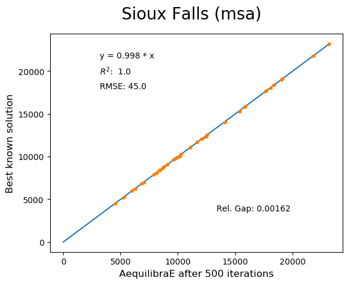
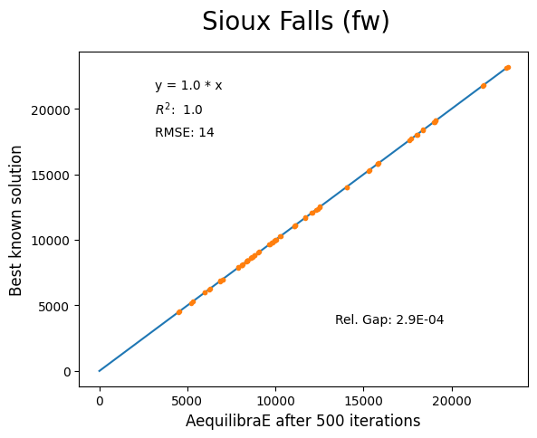
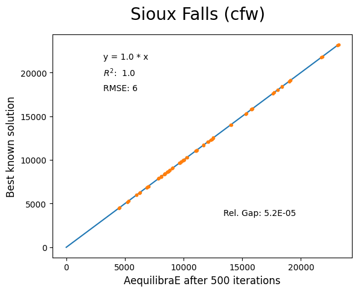
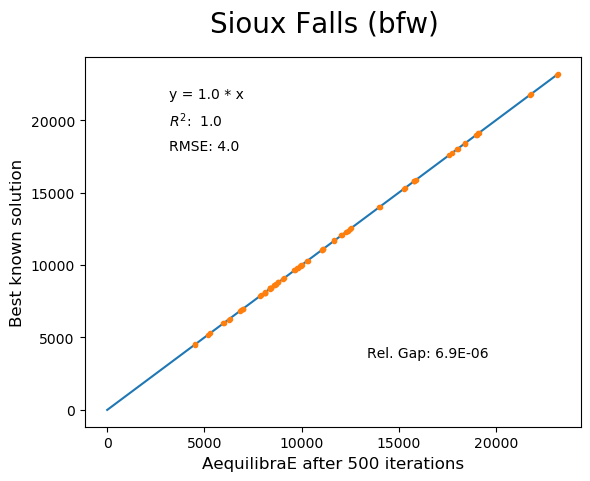

Anaheim
~~~~~~~

Network has:

* Links: 914
* Nodes: 416
* Zones: 38

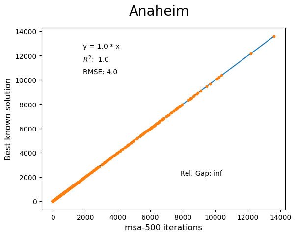
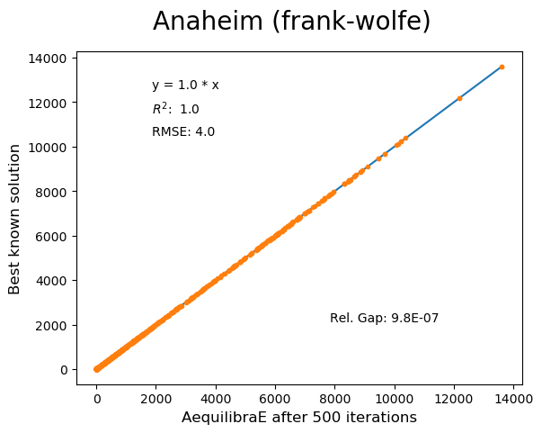
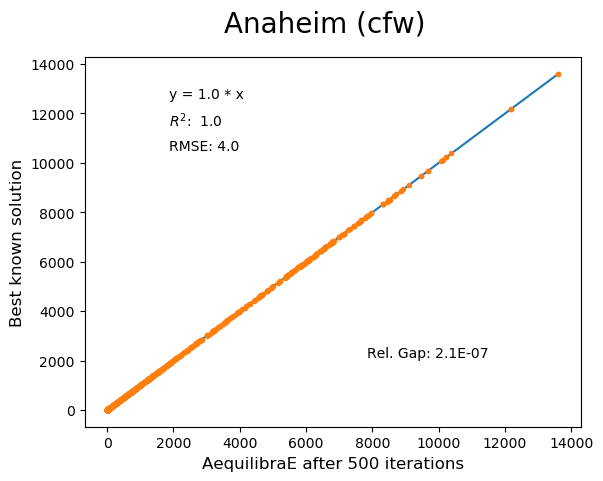

Winnipeg
~~~~~~~~

Network has:

* Links: 914
* Nodes: 416
* Zones: 38

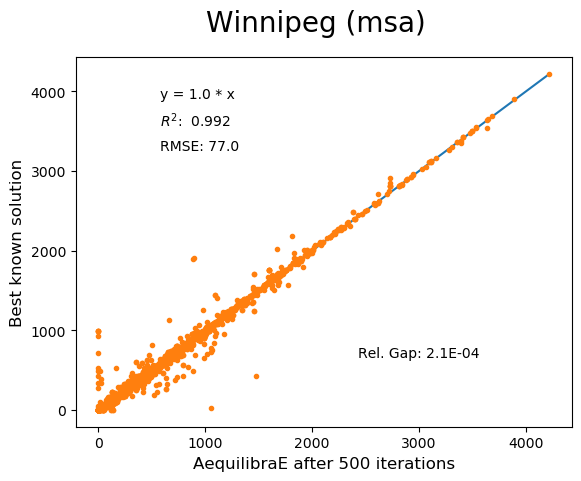
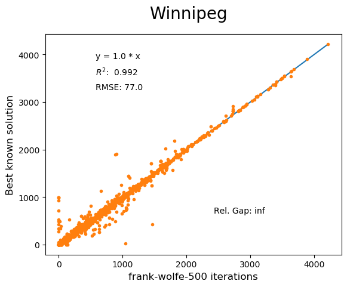

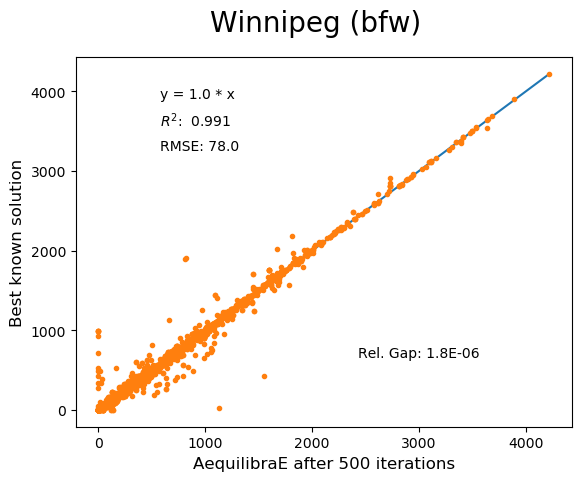

The results for Winnipeg do not seem extremely good when compared to a highly,
but we believe posting its results would suggest deeper investigation by one
of our users :-),

Barcelona
~~~~~~~~~

Network has:

* Links: 2,522
* Nodes: 1,020
* Zones: 110

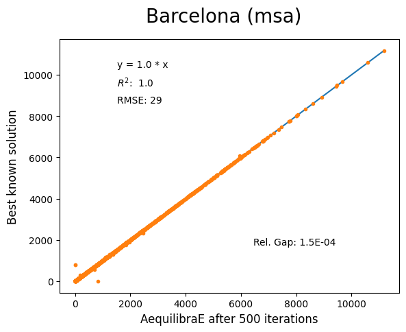
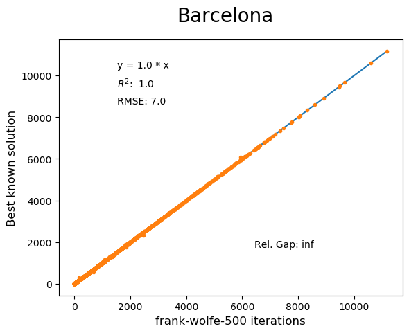
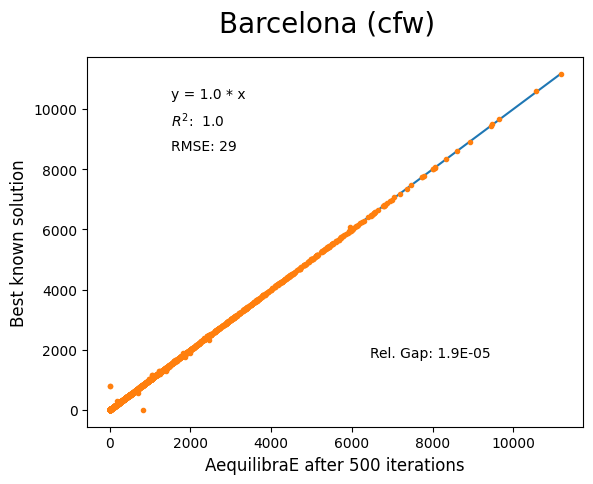
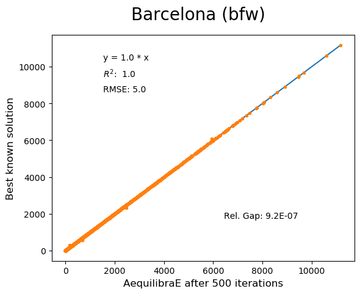

Chicago Regional
~~~~~~~~~~~~~~~~

Network has:

* Links: 39,018
* Nodes: 12,982
* Zones: 1,790

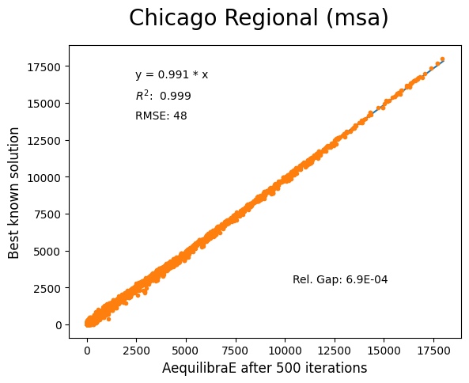
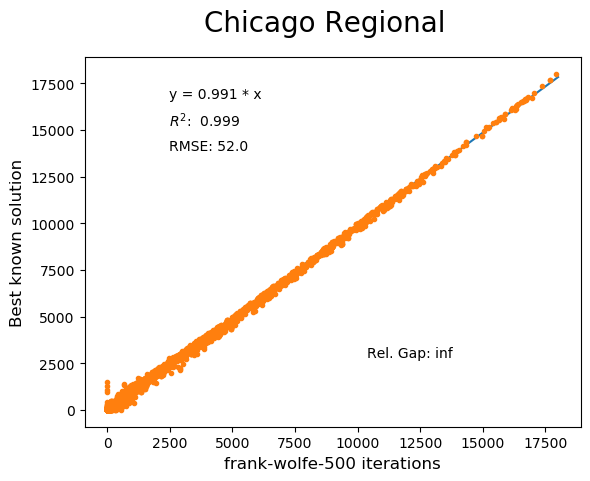
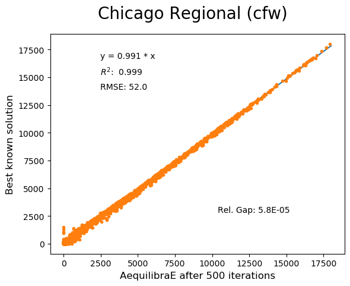
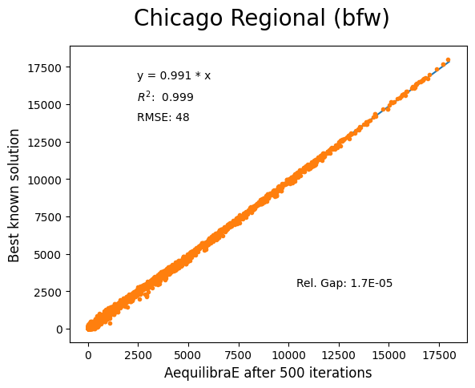

Convergence Study
-----------------

Besides validating the final results from the algorithms, we have also compared
how well they converge for the largest instance we have tested (Chicago
Regional), as that instance has a comparable size to real-world models.

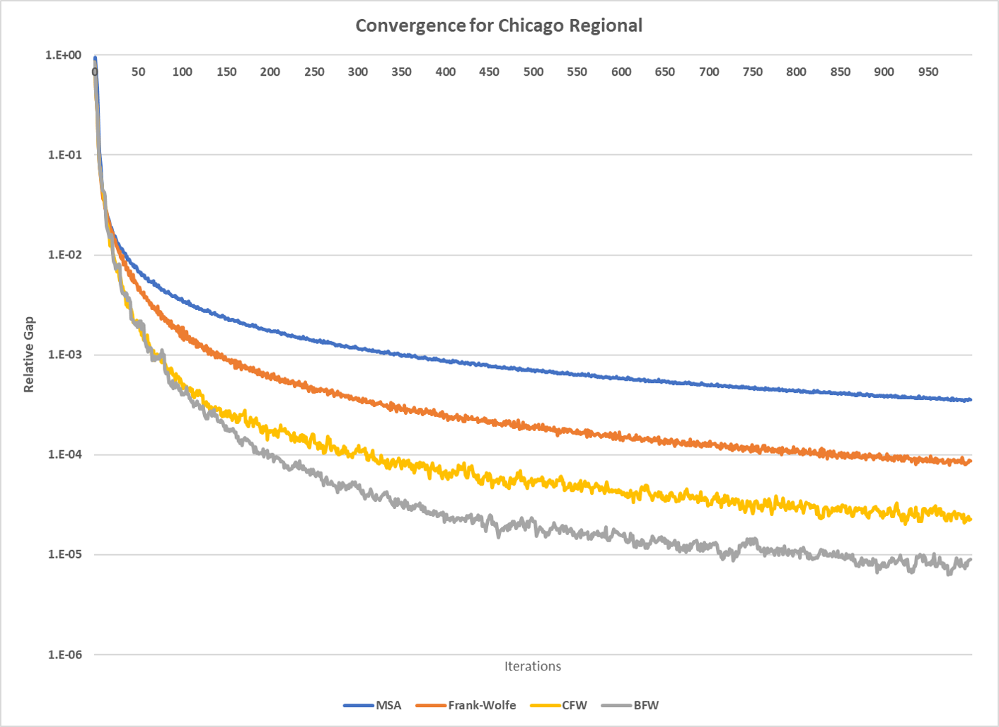

Not surprinsingly, one can see that Frank-Wolfe far outperforms the Method of
Successive Averages for a number of iterations larger than 25, and is capable of
reaching 1.0e-04 just after 800 iterations, while MSA is still at 3.5e-4 even
after 1,000 iterations.

The actual show, however, is left for the Biconjugate Frank-Wolfe
implementation, which delivers a relative gap of under 1.0e-04 in under 200
iterations, and a relative gap of under 1.0e-05 in just over 700 iterations.

This convergence capability, allied to its computational performance described
below suggest that AequilibraE is ready to be used in large real-world
applications.

Computational performance
-------------------------
Running on a Thinkpad X1 extreme equipped with a 6 cores 8750H CPU and 32Gb of
2667Hz RAM, AequilibraE performed 1,000 iterations of Frank-Wolfe assignment
on the Chicago Network in just under 46 minutes, while Biconjugate Frank Wolfe
takes just under 47 minutes.

During this process, the sustained CPU clock fluctuated between 3.05 and 3.2GHz
due to the laptop's thermal constraints, suggesting that performance in modern
desktops would be better

Noteworthy items
----------------

.. note::
   The biggest opportunity for performance in AequilibraE right now it to apply
   network contraction hierarchies to the building of the graph, but that is
   still a long-term goal

