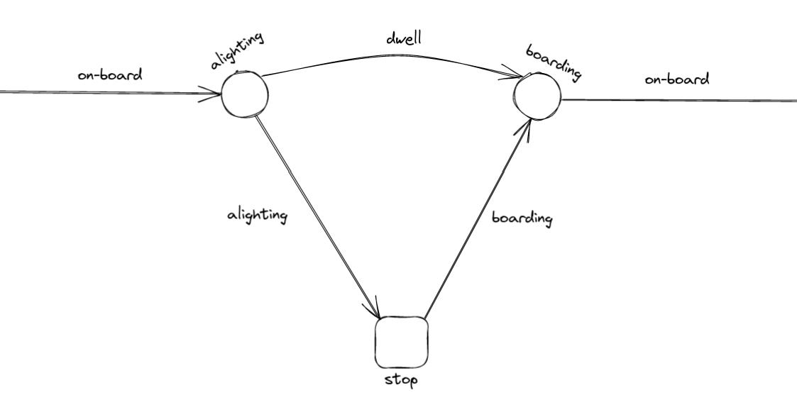
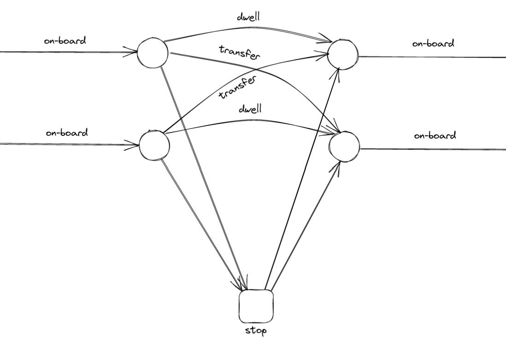
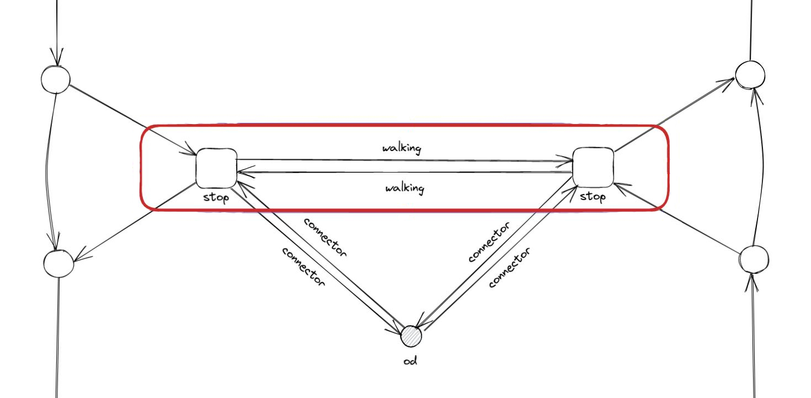
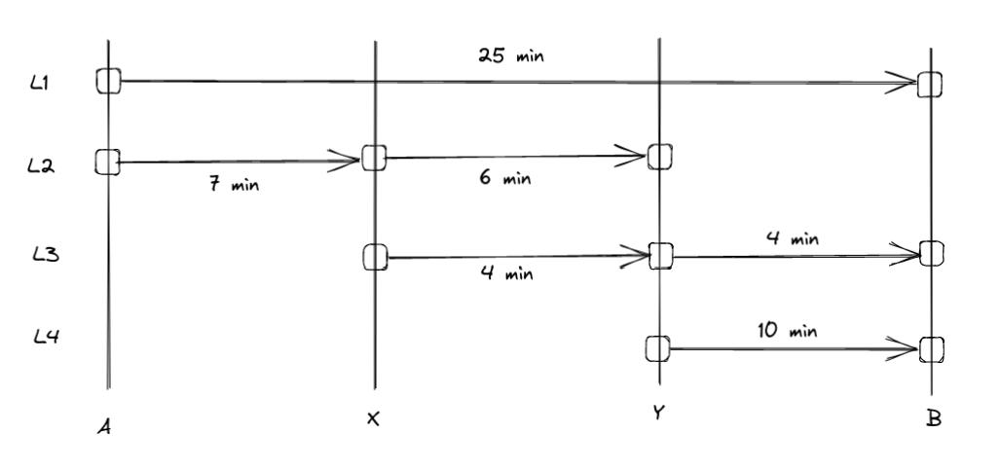
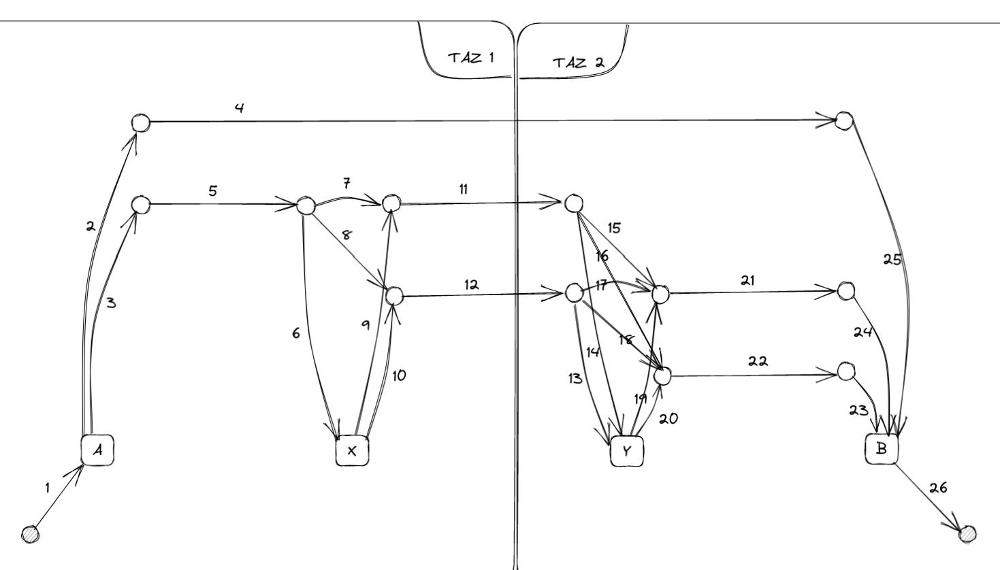

:orphan:

Transit assignment
==================

Transit assignment models are mathematical tools that predict how passengers
behave and travel in a transit network, given some assumptions and inputs.

Transit assignment models aim to answer questions such as: 

- How do transit passengers choose their routes in a complex network of lines and services?

- How can we estimate the distribution of passenger flows and the performance of transit systems?

Transit assignment graph
------------------------

In this section, we describe a graph structure for a transit network used for static, link-based,
frequency-based assignment. Our focus is the classic algorithm *optimal strategies* by Spiess and
Florian (1989) [1]_.

Let's start by giving a few definitions:

- **transit**: according to `Wikipedia <https://en.wikipedia.org/wiki/Public_transport>`_, it is a
  *"system of transport for passengers by group travel systems available for use by the general public 
  unlike private transport, typically managed on a schedule, operated on established routes, and that
  charge a posted fee for each trip."*

- **transit network**: a set of transit lines and stops, where passengers can board, alight or 
  change vehicles.

- **assignment**: distribution of the passengers (demand) on the network (supply), knowing that 
  transit users attempt to minimize total travel time, time or distance walking, time waiting, 
  number of transfers, fares, etc…

- **static assignment**: assignment without time evolution. Dynamic properties of the flows, such 
  as congestion, are not well described, unlike with dynamic assignment models.

- **schedule-based approach**: in this approach, distinct vehicle trips are represented by
  distinct links. We can see the associated network as a time-expanded network, where the third 
  dimension would be time.

- **frequency-based** (or **headway-based**) **approach**: unlike with the schedule-based approach, 
  the schedules are averaged in order to get line frequencies.
   
- **link-based approach**: in this approach, the assignment algorithm is not evaluating paths, or
  any aggregated information besides attributes stored by nodes and links. In the present case, 
  each link has an associated cost (travel-time, :math:`s`) and frequency (:math:`f = 1/s`).

Elements of a transit network
~~~~~~~~~~~~~~~~~~~~~~~~~~~~~

These are the elements required to describe an assignment graph.

* **Transit stops and stations**: transit stops are points where passenger can board, alight or change
  vehicles. Also, they can be part of larger stations. In the illustratation below, two distinct
  stops ('A' and 'B') are highlighted, and they are both affiliated with the same station (depicted 
  in red).

  .. image:: _images/transit/transit_graph_stops_stations.png
     :scale: 60%
     :align: center
     :alt: transit stops and stations

* **Transit lines**: a transit line is a set of services that may use different routes, decomposed 
  into segments.

* **Transit routes**: a route is described by a sequence of stop nodes. We assume here the routes 
  to be directed. For example, we can take a simple case with 3 stops. In this case, the 'L1' line
  is made of two different routes: 'ABC' and 'CBA'.

  .. image:: _images/transit/transit_graph_routes_1.png
     :scale: 60%
     :align: center
     :alt: transit routes 1

  A route can present various configurations, such as a partial route at a given moment of the day
  ('AB'), a route with an additional stop ('ABDC'), a route that does not stop at a given stop ('AC').

  .. image:: _images/transit/transit_graph_routes_2.png
     :scale: 60%
     :align: center
     :alt: transit routes 2

  Lines can also be decomposed into multiple sub-lines, each representing distinct routes. For the 
  given example, we may have several sub-lines under the same commercial line (L1).

  .. table::
     :align: center
     :width: 40%
 
     +---------+-----------------+---------------+-------------+
     | Line ID | Commercial Name | Stop Sequence | Headway (s) |
     +=========+=================+===============+=============+
     | L1_a1   | L1              | ABC           | 600         |
     +---------+-----------------+---------------+-------------+
     | L1_a2   | L1              | ABDC          | 3,600       |
     +---------+-----------------+---------------+-------------+
     | L1_a3   | L1              | AB            | 3,600       |
     +---------+-----------------+---------------+-------------+
     | L1_a4   | L1              | AC            | 3,600       |
     +---------+-----------------+---------------+-------------+
     | L1_b1   | L1              | CBA           | 600         |
     +---------+-----------------+---------------+-------------+

  Associated with each sub-line, the headway corresponds to the mean time range between consecutive 
  vehicles — the inverse of the line frequency used as a link attribute in the assignment algorithm.

* **Line segments**: a line segment represents a portion of a transit line between two consecutive 
  stops. Using the example line 'L1_a1', we derive two distinct line segments:

  .. table::
    :align: center
    :width: 40%

    +----------+---------------+-------------+-------------------+--------------+
    | Line ID  | Segment Index | Origin Stop | Destination Stop  | Travel Time  |
    +==========+===============+=============+===================+==============+
    | L1_a1    | 1             | A           | B                 | 300          |
    +----------+---------------+-------------+-------------------+--------------+
    | L1_a1    | 2             | B           | C                 | 600          |
    +----------+---------------+-------------+-------------------+--------------+

Note that a travel time is included for each line segment, serving as another link attribute used 
by the assignment algorithm.

* **Transit Assignment Zones**: transit assignment zones correspond to the partition of
  the network area. The illustration below presents 4 non-overlapping zones, whose demand
  is expressed as a number of trips from each zone to every other zone, forming a 4 x 4 
  Origin-Destination (OD) matrix.

  .. image:: _images/transit/transit_graph_zones.png
    :scale: 60%
    :align: center
    :alt: transit zones

* **Connectors**: connectors are special network nodes that facilitate the connection between supply 
  and demand.

  .. image:: _images/transit/transit_graph_connectors.png
    :scale: 60%
    :align: center
    :alt: transit connectors

The assignment graph
~~~~~~~~~~~~~~~~~~~~

The transit network is used to generate a graph with specific nodes and links used to model the 
transit process. Various link types and node categories play crucial roles in this representation.

.. table::
    :align: center
    :width: 40%

    +------------+------------+
    | Link types | Node types |
    +============+============+
    | On-board   | Stop       |
    +------------+------------+
    | Boarding   | Boarding   |
    +------------+------------+
    | Alighting  | Alighting  |
    +------------+------------+
    | Dwell      | OD         |
    +------------+------------+
    | Transfer   | Walking    |
    +------------+------------+
    | Connector  |            |
    +------------+            |
    | Walking    |            |
    +------------+------------+

To illustrate, consider the anatomy of a simple stop (figure below). Waiting links encompass boarding 
and transfer links. Each line segment is associated with a boarding, an on-board and an alighting link.

Transfer links enable to compute the passenger flow count between line couples at the same stop. These 
links can be extended between all lines of a station if an increase in the number of links is viable.

Walking links connect *stop* nodes within a station, while *connector* links connect the zone centroids 
(OD nodes) to *stop* nodes. Connectors that connect OD to *stop* nodes allow passengers to access the 
network, while connectors in the opposite direction allow them to egress. Walking nodes/links may also 
be used to connect stops from distant stations.

The table below summarizes link characteristics and attributes based on link types:

.. table::
   :align: center
   :width: 60%
      
   +-----------+-----------------+-----------------+-------------+------------------+
   | Link Type | From node type  | To node type    | Cost        | Frequency        |
   +===========+=================+=================+=============+==================+
   | on-board  | boarding        | alighting       | travel time | :math:`\infty`   |
   +-----------+-----------------+-----------------+-------------+------------------+
   | boarding  | stop            | boarding        | constant    | line frequency   |
   +-----------+-----------------+-----------------+-------------+------------------+
   | alighting | alighting       | stop            | constant    | :math:`\infty`   |
   +-----------+-----------------+-----------------+-------------+------------------+
   | dwell     | alighting       | boarding        | constant    | :math:`\infty`   |
   +-----------+-----------------+-----------------+-------------+------------------+
   | transfer  | alighting       | boarding        | constant +  | destination line |
   |           |                 |                 | travel time | frequency        |
   +-----------+-----------------+-----------------+-------------+------------------+
   | connector | OD or stop      | OD or stop      | travel time | :math:`\infty`   |
   +-----------+-----------------+-----------------+-------------+------------------+
   | walking   | stop or walking | stop or walking | travel time | :math:`\infty`   |
   +-----------+-----------------+-----------------+-------------+------------------+

The travel time is specific to each line segment or walking time. For example, there can be 10 
minutes connection between stops in a large transit station. Constant boarding and alighting times 
are applied uniformly across the network, and dwell links have constant cost equal to the sum of 
the alighting and boarding constants.

Additional attributes can be introduced for specific link types, such as: 

- ``line_id``: for on-board, boarding, alighting and dwell links. 

- ``line_seg_idx``: the line segment index for boarding, on-board and alighting links. 

- ``stop_id``: for alighting, dwell and boarding links. This can also apply to transfer links for 
  inner stop transfers. 

- ``o_line_id``: origin line ID for transfer links.

- ``d_line_id``: destination line ID for transfer links.

Assignment graph example - Based on Spiess and Florian (1989)
^^^^^^^^^^^^^^^^^^^^^^^^^^^^^^^^^^^^^^^^^^^^^^^^^^^^^^^^^^^^^

This illustrative example is taken from Spiess and Florian (1989) [1]_.

The following figure presents the travel times for each line.

We have the following four distinct line characteristics:

.. table::
   :align: center
   :width: 40%

   +---------+-------+---------------+-----------------+
   | Line ID | Route | Headway (min) | Frequency (1/s) |
   +=========+=======+===============+=================+
   | L1      | AB    |          12   |     0.001388889 |
   +---------+-------+---------------+-----------------+
   | L2      | AXY   |          12   |     0.001388889 |
   +---------+-------+---------------+-----------------+
   | L3      | XYB   |          30   |     0.000555556 |
   +---------+-------+---------------+-----------------+
   | L4      | YB    |           6   |     0.002777778 |
   +---------+-------+---------------+-----------------+

Passengers aim to travel from A to B, prompting the division of the network area into two distinct 
zones: TAZ 1 and TAZ 2. The assignment graph associated with this network encompasses 26 links:

Here is a table listing all links:

.. table::
   :align: center
   :width: 50%

   +---------+-----------+---------+------+--------------+
   | Link ID | Link Type | Line ID | Cost |    Frequency |
   +=========+===========+=========+======+==============+
   |       1 | connector |         |    0 |:math:`\infty`|
   +---------+-----------+---------+------+--------------+
   |       2 |  boarding |      L1 |    0 |  0.001388889 |
   +---------+-----------+---------+------+--------------+
   |       3 |  boarding |      L2 |    0 |  0.001388889 |
   +---------+-----------+---------+------+--------------+
   |       4 |  on-board |      L1 | 1500 |:math:`\infty`|
   +---------+-----------+---------+------+--------------+
   |       5 |  on-board |      L2 |  420 |:math:`\infty`|
   +---------+-----------+---------+------+--------------+
   |       6 | alighting |      L2 |    0 |:math:`\infty`|
   +---------+-----------+---------+------+--------------+
   |       7 |     dwell |      L2 |    0 |:math:`\infty`|
   +---------+-----------+---------+------+--------------+
   |       8 |  transfer |         |    0 |  0.000555556 |
   +---------+-----------+---------+------+--------------+
   |       9 |  boarding |      L2 |    0 |  0.001388889 |
   +---------+-----------+---------+------+--------------+
   |      10 |  boarding |      L3 |    0 |  0.000555556 |
   +---------+-----------+---------+------+--------------+
   |      11 |  on-board |      L2 |  360 |:math:`\infty`|
   +---------+-----------+---------+------+--------------+
   |      12 |  on-board |      L3 |  240 |:math:`\infty`|
   +---------+-----------+---------+------+--------------+
   |      13 | alighting |      L3 |    0 |:math:`\infty`|
   +---------+-----------+---------+------+--------------+
   |      14 | alighting |      L2 |    0 |:math:`\infty`|
   +---------+-----------+---------+------+--------------+
   |      15 |  transfer |      L3 |    0 |  0.000555556 |
   +---------+-----------+---------+------+--------------+
   |      16 |  transfer |         |    0 |  0.002777778 |
   +---------+-----------+---------+------+--------------+
   |      17 |     dwell |      L3 |    0 |:math:`\infty`|
   +---------+-----------+---------+------+--------------+
   |      18 |  transfer |         |    0 |  0.002777778 |
   +---------+-----------+---------+------+--------------+
   |      19 |  boarding |      L3 |    0 |  0.000555556 |
   +---------+-----------+---------+------+--------------+
   |      20 |  boarding |      L4 |    0 |  0.002777778 |
   +---------+-----------+---------+------+--------------+
   |      21 |  on-board |      L3 |  240 |:math:`\infty`|
   +---------+-----------+---------+------+--------------+
   |      22 |  on-board |      L4 |  600 |:math:`\infty`|
   +---------+-----------+---------+------+--------------+
   |      23 | alighting |      L4 |    0 |:math:`\infty`|
   +---------+-----------+---------+------+--------------+
   |      24 | alighting |      L3 |    0 |:math:`\infty`|
   +---------+-----------+---------+------+--------------+
   |      25 | alighting |      L1 |    0 |:math:`\infty`|
   +---------+-----------+---------+------+--------------+
   |      26 | connector |         |    0 |:math:`\infty`|
   +---------+-----------+---------+------+--------------+

Transit graph specificities in AequilibraE
~~~~~~~~~~~~~~~~~~~~~~~~~~~~~~~~~~~~~~~~~~

The graph creation process in AequilibraE incorporates several edge types to capture the nuances of 
transit networks. Notable distinctions include:

* Connectors

  - access connectors: directed from od nodes to the network   
  - egress connectors: directed from the network to the od nodes  

* Transfer edges

  - inner transfer: connect lines within the same stop  
  - outer transfer: connect lines between distinct stops within the same station  

* Origin and destination nodes

  - origin nodes: represent the starting point of passenger trips
  - destination nodes: represent the end point of passenger trips

Users can customize these features using boolean parameters:

- ``with_walking_edges``: create walking edges between the stops of a station

- ``with_inner_stop_transfers``: create transfer edges between lines of a stop

- ``with_outer_stop_transfers``: create transfer edges between lines of different stops of a station

- ``blocking_centroid_flow``: duplicate OD nodes into unconnected origin and destination nodes in 
  order to block centroid flows. Flows starts from an origin node and ends at a destination node. 
  It is not possible to use an egress connector followed by an access connector in the middle of a
  trip.

Note that during the assignment, if passengers have the choice between a transfer edge or a walking 
edge for a line change, they will always be assigned to the transfer edge. This leads to these 
possible edge types:

- on-board
- boarding
- alighting
- dwell
- access_connector
- egress_connector
- inner_transfer
- outer_transfer
- walking

Hyperpath routing
-----------------

Hyperpath routing is one of the basic concepts in transit assignment models, and it is a way
of representing the set of optimal routes that a passenger can take from an origin to a destination, 
based on some criterion such as travel time or generalized cost. A hyperpath is a collection of 
links that form a subgraph of the transit network. Each link in the hyperpath also has a 
probability of being used by the passenger, which reflects the attractiveness and uncertainty 
of the route choice. The shortest hyperpath is optimal regarding the combination of paths weighted 
by the probability of being used.

Hyperpath routing can be applied to different types of transit assignment models, but here we will 
focus on frequency-based models. Frequency-based models assume that passengers do not have reliable 
information about the service schedules and arrival times, and they choose their routes based on the 
expected travel time or cost. This type of model is suitable for transit systems with rather
frequent services.

To illustrate how hyperpath routing works in frequency-based models, we will use the algorithm by 
Spiess and Florian [1]_ implemented in AequilibraE.

For example purposes, we will use a simple grid network as an Python example to demonstrate how a
hyperpath depends on link frequency for a given origin-destination pair. Note that it can be 
extended to other contexts such as risk-averse vehicle navigation [2]_.

Bell's network
~~~~~~~~~~~~~~

We start by defining the directed graph :math:`\mathcal{G} = \left( V, E \right)`, where :math:`V` 
and :math:`E` are the graph vertices and edges. The hyperpath generating algorithm requires 2 
attributes for each edge :math:`a \in V`: 

- edge travel time: :math:`u_a \geq 0` 

- edge frequency: :math:`f_a \geq 0`

The edge frequency is inversely related to the exposure to delay. For example, in a transit network, 
a boarding edge has a frequency that is the inverse of the headway (or half the headway, depending 
on the model assumptions). A walking edge has no exposure to delay, so its frequency is assumed to 
be infinite.

Bell's network is a synthetic network: it is a :math:`n`-by-:math:`n` grid bi-directional network 
[2]_ [3]_. The edge travel time is taken as random number following a uniform distribution:

.. math:: u_a \sim \mathbf{U}[0,1)

To demonstrate how the hyperpath depends on the exposure to delay, we will use a positive constant 
(:math:`\alpha`) and a base delay (:math:`d_a`) for each edge that follows a uniform distribution:

.. math:: d_a \sim \mathbf{U}[0,1)

The constant :math:`\alpha \geq 0` allows us to adjust the edge frequency as follows: 

.. math::

   f_a = \left\{
   \begin{array}{ll}
   1 / \left( \alpha \; d_a \right) & \text{if $\alpha \; d_a \neq 0$} \\ 
   \infty & \text{otherwise} \\
   \end{array} 
   \right.

Notice that a smaller :math:`\alpha` value implies higher edge frequencies, and vice versa. 

Hyperpath computation
~~~~~~~~~~~~~~~~~~~~~

Let's create a function that:

- creates the network, 
- computes the edge frequency given an input value for :math:`\alpha`, 
- computes the shortest hyperpath, 
- and plots the network and hyperpath.

We start with :math:`\alpha=0`. This implies that there is no delay over all the network. The
resulting hyperpath corresponds to the same shortest path that Dijkstra's algorithm would have
computed. You can call NetworkX's method ``nx.dijkstra_path`` to compute the shortest path.

.. subfigure:: AB
    :align: center

    .. image:: _images/transit/hyperpath_bell_n_10_alpha_0d0.png
        :alt: Shortest hyperpath - Bell's network alpha=0.0

    .. image:: _images/transit/hyperpath_bell_n_10_shartest_path.png
        :alt: Shortest path - Bell's network

To introduce some delay in the network, we can increase the value of :math:`\alpha`. We notice
that the shortest path is no longer unique and multiple routes are suggested. The link usage 
probability is reflected by the line width. The majority of the flow still follows the shortest 
path, but some of it is distributed among different alternative paths. This becomes more
apparent as we further increase :math:`\alpha`.

.. subfigure:: ABC
    :align: center

    .. image:: _images/transit/hyperpath_bell_n_10_alpha_0d5.png
        :alt: Shortest hyperpath - Bell's network alpha=0.5

    .. image:: _images/transit/hyperpath_bell_n_10_alpha_1d0.png
        :alt: Shortest hyperpath - Bell's network alpha=1.0

    .. image:: _images/transit/hyperpath_bell_n_10_alpha_100d0.png
        :alt: Shortest hyperpath - Bell's network alpha=100.0

The code below allows you to reproduce the same experiment that resulted in the previous figures.

.. code-block:: python
   :caption: Hyperpath computation

    # Let's import some packages
    import matplotlib.pyplot as plt
    import networkx as nx
    import numpy as np
    import pandas as pd

    from aequilibrae.paths.public_transport import HyperpathGenerating
    from numba import jit

    RANDOM_SEED = 124  # random seed
    FIGURE_SIZE = (6, 6)  # figure size

    def create_vertices(n):
        x = np.linspace(0, 1, n)
        y = np.linspace(0, 1, n)
        xv, yv = np.meshgrid(x, y, indexing="xy")
        vertices = pd.DataFrame()
        vertices["x"] = xv.ravel()
        vertices["y"] = yv.ravel()
        return vertices

    @jit
    def create_edges_numba(n):
        m = 2 * n * (n - 1)
        tail = np.zeros(m, dtype=np.uint32)
        head = np.zeros(m, dtype=np.uint32)
        k = 0
        for i in range(n - 1):
            for j in range(n):
                tail[k] = i + j * n
                head[k] = i + 1 + j * n
                k += 1
                tail[k] = j + i * n
                head[k] = j + (i + 1) * n
                k += 1
        return tail, head

    def create_edges(n, seed=124):
        tail, head = create_edges_numba(n)
        edges = pd.DataFrame()
        edges["tail"] = tail
        edges["head"] = head
        m = len(edges)
        rng = np.random.default_rng(seed=seed)
        edges["trav_time"] = rng.uniform(0.0, 1.0, m)
        edges["delay_base"] = rng.uniform(0.0, 1.0, m)
        return edges

    def generate_hyperpath(n, alpha):
        edges = create_edges(n, seed=RANDOM_SEED)
        delay_base = edges.delay_base.values
        indices = np.where(delay_base == 0.0)
        delay_base[indices] = 1.0
        freq_base = 1.0 / delay_base
        freq_base[indices] = np.inf

        edges["freq_base"] = freq_base
        if alpha == 0.0:
            edges["freq"] = np.inf
        else:
            edges["freq"] = edges.freq_base / alpha

        # Spiess & Florian
        sf = HyperpathGenerating(
            edges, tail="tail", head="head", trav_time="trav_time", freq="freq"
        )
        sf.run(origin=0, destination=n * n - 1, volume=1.0)

        return sf

    def plot_shortest_hyperpath(n=10, alpha=10.0, is_dijkstra=False, figsize=FIGURE_SIZE, title=""):
        vertices = create_vertices(n)
        n_vertices = n * n
        sf = generate_hyperpath(n, alpha)
        
        attr = "trav_time" if is_dijkstra else "volume"

        # NetworkX
        G = nx.from_pandas_edgelist(
            sf._edges,
            source="tail",
            target="head",
            edge_attr=attr,
            create_using=nx.DiGraph,
        )

        if is_dijkstra:
            nodes = nx.dijkstra_path(G, 0, n*n-1, weight='trav_time')
            edges = list(nx.utils.pairwise(nodes))
            widths = 1e2 * np.array([1 if (u,v) in edges else 0 for u, v in G.edges()]) / n
        else:
            widths = 1e2 * np.array([G[u][v]["volume"] for u, v in G.edges()]) / n
        pos = vertices[["x", "y"]].values

        _ = plt.figure(figsize=figsize)
        node_colors = n_vertices * ["gray"]
        node_colors[0] = "r"
        node_colors[-1] = "r"
        ns = 100 / n
        node_size = n_vertices * [ns]
        node_size[0] = 20 * ns
        node_size[-1] = 20 * ns
        labeldict = {}
        labeldict[0] = "O"
        labeldict[n * n - 1] = "D"
        nx.draw(
            G,
            pos=pos,
            width=widths,
            node_size=node_size,
            node_color=node_colors,
            arrowstyle="-",
            labels=labeldict,
            with_labels=True,
        )
        ax = plt.gca()
        _ = ax.set_title(title, color="k")

    plot_shortest_hyperpath(n=10, alpha=0.0, title="Shortest hyperpath - Bell's Network $\\alpha$=0.0")
    plot_shortest_hyperpath(n=10, alpha=0.0, is_dijkstra=True, title="Shortest path - Dijkstra's Algorithm")
    plot_shortest_hyperpath(n=10, alpha=0.5, title="Shortest hyperpath - Bell's Network $\\alpha$=0.5")
    plot_shortest_hyperpath(n=10, alpha=1.0, title="Shortest hyperpath - Bell's Network $\\alpha$=1.0")
    plot_shortest_hyperpath(n=10, alpha=100.0, title="Shortest hyperpath - Bell's Network $\\alpha$=100.0")

References
----------

.. [1] Spiess, H. and Florian, M. (1989) "Optimal strategies: A new assignment model for transit networks". 
       Transportation Research Part B: Methodological, 23(2), 83-102. 
       Available in: https://doi.org/10.1016/0191-2615(89)90034-9

.. [2] Ma, J., Fukuda, D. and Schmöcker, J.D. (2012) "Faster hyperpath generating algorithms for vehicle navigation",
       Transportmetrica A: Transport Science, 9(10), 925–948. 
       Available in: https://doi.org/10.1080/18128602.2012.719165

.. [3] Bell, M.G.H. (2009) "Hyperstar: A multi-path Astar algorithm for risk averse vehicle navigation", 
       Transportation Research Part B: Methodological, 43(1), 97-107.
       Available in: https://doi.org/10.1016/j.trb.2008.05.010.
