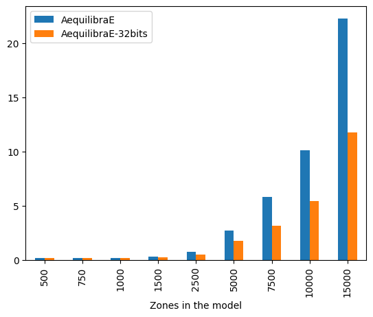
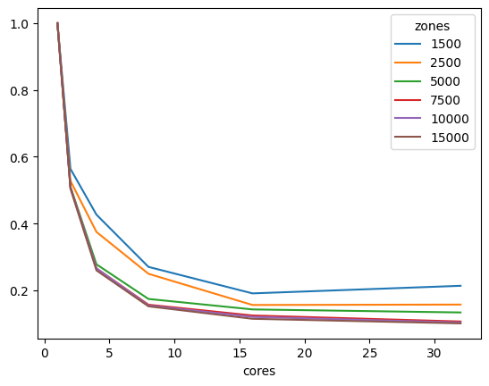

IPF Performance
===============

The use of iterative proportional fitting (IPF) is quite common on
processes involving doubly-constraining matrices, such as synthetic
gravity models and fractional split models (aggregate destination-choice
models).

As this is a commonly used algorithm, we have implemented it in Cython,
where we can take full advantage of multi-core CPUs. We have also
implemented the ability of using both 32-bit and 64-bit floating-point
seed matrices, which has direct impact on cache use and consequently
computational performance.

In this section, we compare the runtime of AequilibraE’s current
implementation of IPF, with a general IPF algorithm written in pure
Python, available
`here <https://github.com/joshchea/python-tdm/blob/master/scripts/CalcDistribution.py>`__.

The figure below compares AequilibraE’s IPF runtime with one core with
the benchmark Python code. From the figure below, we can notice that the
runtimes were practically the same for the instances with 1,000 zones or
less. As the number of zones increases, AequilibraE demonstrated to be
slightly faster than the benchmark python code, while applying IPF to a
32-bit NumPy array (np.float32) was significantly faster. It’s worth
mentioning that the user can set up a threshold for AequilibraE’s IPF
function, as well as use more than one core to speed up the fitting
process.

.. figure:: ../../images/ipf_runtime_aequilibrae_vs_benchmark.png
   :alt: AequilibraE’s IPF runtime

   AequilibraE’s IPF runtime

As IPF is an embarrassingly-parallel workload, it is more relevant to
look at the performance of the AequilibraE implementations, starting by
comparing the implementation performance for inputs in 32 vs 64 bits
using 32 threads.

   AequilibraE’s IPF runtime 32 vs 64 bits

The difference is staggering, with the 32-bit implementation being twice
as fast as the 64-bit one for large matrices. It is also worth noting
that differences in results between the outputs between these two
versions are incredibly small (RMSE < 1.1e-10), and therefore unlikely
to be relevant in most applications.

We can also look at performance gain across matrix sizes and number of
cores, and it becomes clear that the 32-bit version scales significantly
better than its 64-bit counterpart, showing significant performance
gains up to 16 threads, while the latter stops showing much improvement
beyond 8 threads, likely due to limitations on cache size.

.. figure:: ../../images/ipf_runtime_vs_num_cores.png
   :alt: number of cores used in IPF for 64 bit matrices

   number of cores used in IPF for 64 bit matrices

   number of cores used in IPF for 32 bit matrices

In conclusion, AequilibraE’s IPF implementation is over 11 times faster
than its pure Python counterpart for large matrices on a workstation,
largely due to the use of Cython and multi-threading, but also due to
the use of a 32-bit version of the algorithm.

These tests were run on a Threadripper 3970x (released in 2019)
workstation with 32 cores (64 threads) @ 3.7 GHz and 256 Gb of RAM. The
code is provided below for reference.

Reference code
--------------

.. code:: ipython2

    from copy import deepcopy
    from time import perf_counter
    import numpy as np
    import pandas as pd
    from aequilibrae.distribution.ipf_core import ipf_core
    from tqdm import tqdm

.. code:: ipython2

    # From:
    # https://github.com/joshchea/python-tdm/blob/master/scripts/CalcDistribution.py
    
    def CalcFratar(ProdA, AttrA, Trips1, maxIter=10):
        '''Calculates fratar trip distribution
           ProdA = Production target as array
           AttrA = Attraction target as array
           Trips1 = Seed trip table for fratar
           maxIter (optional) = maximum iterations, default is 10
           Returns fratared trip table
        '''
        # print('Checking production, attraction balancing:')
        sumP = ProdA.sum()
        sumA = AttrA.sum()
        # print('Production: ', sumP)
        # print('Attraction: ', sumA)
        if sumP != sumA:
            # print('Productions and attractions do not balance, attractions will be scaled to productions!')
            AttrA = AttrA*(sumP/sumA)
        else:
            pass
            # print('Production, attraction balancing OK.')
        # Run 2D balancing --->
        for balIter in range(0, maxIter):
            ComputedProductions = Trips1.sum(1)
            ComputedProductions[ComputedProductions == 0] = 1
            OrigFac = (ProdA/ComputedProductions)
            Trips1 = Trips1*OrigFac[:, np.newaxis]
    
            ComputedAttractions = Trips1.sum(0)
            ComputedAttractions[ComputedAttractions == 0] = 1
            DestFac = (AttrA/ComputedAttractions)
            Trips1 = Trips1*DestFac
        return Trips1

.. code:: ipython2

    mat_sizes = [500, 750, 1000, 1500, 2500, 5000, 7500, 10000, 15000]

.. code:: ipython2

    #Benchmarking
    bench_data = []
    cores = 1
    repetitions = 5
    iterations = 100
    for zones in mat_sizes:
        for repeat in tqdm(range(repetitions), f"Repetitions for zone size {zones}"):
            mat1 = np.random.rand(zones, zones)
            target_prod = np.random.rand(zones)
            target_atra = np.random.rand(zones)
            target_atra *= target_prod.sum()/target_atra.sum()
    
            aeq_mat = deepcopy(mat1)
            # We use a nonsensical negative tolerance to force it to run all iterations
            # and set warning for non-convergence to false, as we know it won't converge
            t = perf_counter()
            ipf_core(aeq_mat, target_prod, target_atra, max_iterations=iterations, tolerance=-5, cores=cores, warn=False)
            aeqt = perf_counter() - t
    
            aeq_mat32 = np.array(mat1, np.float32)
            # We now run the same thing with a seed matrix in single-precision (float 32 bits) instead of double as above (64 bits)
            t = perf_counter()
            ipf_core(aeq_mat32, target_prod, target_atra, max_iterations=iterations, tolerance=-5, cores=cores, warn=False)
            aeqt2 = perf_counter() - t
            
            bc_mat = deepcopy(mat1)
            t = perf_counter()
            x = CalcFratar(target_prod, target_atra, bc_mat, maxIter=iterations)
    
            bench_data.append([zones, perf_counter() - t, aeqt, aeqt2])

.. parsed-literal::

    Repetitions for zone size 500: 100%|██████████| 5/5 [00:01<00:00,  2.60it/s]
    Repetitions for zone size 750: 100%|██████████| 5/5 [00:04<00:00,  1.18it/s]
    Repetitions for zone size 1000: 100%|██████████| 5/5 [00:07<00:00,  1.57s/it]
    Repetitions for zone size 1500: 100%|██████████| 5/5 [00:19<00:00,  3.88s/it]
    Repetitions for zone size 2500: 100%|██████████| 5/5 [00:56<00:00, 11.24s/it]
    Repetitions for zone size 5000: 100%|██████████| 5/5 [03:44<00:00, 44.89s/it]
    Repetitions for zone size 7500: 100%|██████████| 5/5 [08:09<00:00, 97.89s/it]
    Repetitions for zone size 10000: 100%|██████████| 5/5 [14:11<00:00, 170.34s/it]
    Repetitions for zone size 15000: 100%|██████████| 5/5 [32:23<00:00, 388.70s/it]

.. code:: ipython2

    bench_df = pd.DataFrame(bench_data, columns=["Zones in the model", "PythonCode", "AequilibraE", "AequilibraE-32bits"])
    bench_df.groupby(["Zones in the model"]).mean().plot.bar()

.. parsed-literal::

    <Axes: xlabel='Zones in the model'>

.. image:: IPF_benchmark_files/IPF_benchmark_7_1.png

.. code:: ipython2

    bench_df.groupby(["Zones in the model"]).mean()

.. raw:: html

    

    
    <table border="1" class="dataframe">
      <thead>
        <tr style="text-align: right;">
          <th></th>
          <th>PythonCode</th>
          <th>AequilibraE</th>
          <th>AequilibraE-32bits</th>
        </tr>
        <tr>
          <th>Zones in the model</th>
          <th></th>
          <th></th>
          <th></th>
        </tr>
      </thead>
      <tbody>
        <tr>
          <th>500</th>
          <td>0.103166</td>
          <td>0.140051</td>
          <td>0.137266</td>
        </tr>
        <tr>
          <th>750</th>
          <td>0.241757</td>
          <td>0.302931</td>
          <td>0.297389</td>
        </tr>
        <tr>
          <th>1000</th>
          <td>0.513984</td>
          <td>0.529727</td>
          <td>0.516339</td>
        </tr>
        <tr>
          <th>1500</th>
          <td>1.416848</td>
          <td>1.276844</td>
          <td>1.156637</td>
        </tr>
        <tr>
          <th>2500</th>
          <td>4.253563</td>
          <td>3.581645</td>
          <td>3.333664</td>
        </tr>
        <tr>
          <th>5000</th>
          <td>17.059166</td>
          <td>14.288760</td>
          <td>13.257936</td>
        </tr>
        <tr>
          <th>7500</th>
          <td>35.568686</td>
          <td>32.021563</td>
          <td>29.666000</td>
        </tr>
        <tr>
          <th>10000</th>
          <td>59.030967</td>
          <td>57.028204</td>
          <td>53.155270</td>
        </tr>
        <tr>
          <th>15000</th>
          <td>134.895915</td>
          <td>130.652199</td>
          <td>120.535656</td>
        </tr>
      </tbody>
    </table>
    

.. code:: ipython2

    #Benchmarking 32 threads
    bench_data_parallel = []
    cores = 32
    repetitions = 5
    iterations = 100
    for zones in mat_sizes:
        for repeat in tqdm(range(repetitions), f"Repetitions for zone size {zones}"):
            mat1 = np.random.rand(zones, zones)
            target_prod = np.random.rand(zones)
            target_atra = np.random.rand(zones)
            target_atra *= target_prod.sum()/target_atra.sum()
    
            aeq_mat = deepcopy(mat1)
            # We use a nonsensical negative tolerance to force it to run all iterations
            # and set warning for non-convergence to false, as we know it won't converge
            t = perf_counter()
            ipf_core(aeq_mat, target_prod, target_atra, max_iterations=iterations, tolerance=-5, cores=cores, warn=False)
            aeqt = perf_counter() - t
    
            aeq_mat32 = np.array(mat1, np.float32)
            # We now run the same thing with a seed matrix in single-precision (float 32 bits) instead of double as above (64 bits)
            t = perf_counter()
            ipf_core(aeq_mat32, target_prod, target_atra, max_iterations=iterations, tolerance=-5, cores=cores, warn=False)
            aeqt2 = perf_counter() - t
            
            rmse = np.sqrt(np.mean((aeq_mat-aeq_mat32)**2))
    
            bench_data_parallel.append([zones, aeqt, aeqt2, rmse])

.. parsed-literal::

    Repetitions for zone size 500: 100%|██████████| 5/5 [00:01<00:00,  2.70it/s]
    Repetitions for zone size 750: 100%|██████████| 5/5 [00:01<00:00,  2.64it/s]
    Repetitions for zone size 1000: 100%|██████████| 5/5 [00:02<00:00,  2.37it/s]
    Repetitions for zone size 1500: 100%|██████████| 5/5 [00:03<00:00,  1.61it/s]
    Repetitions for zone size 2500: 100%|██████████| 5/5 [00:07<00:00,  1.41s/it]
    Repetitions for zone size 5000: 100%|██████████| 5/5 [00:24<00:00,  4.91s/it]
    Repetitions for zone size 7500: 100%|██████████| 5/5 [00:49<00:00,  9.96s/it]
    Repetitions for zone size 10000: 100%|██████████| 5/5 [01:26<00:00, 17.29s/it]
    Repetitions for zone size 15000: 100%|██████████| 5/5 [03:10<00:00, 38.02s/it]

.. code:: ipython2

    bench_df_parallel = pd.DataFrame(bench_data_parallel, columns=["Zones in the model", "AequilibraE", "AequilibraE-32bits", "rmse"])
    bench_df_parallel.groupby(["Zones in the model"]).mean()[[ "AequilibraE", "AequilibraE-32bits"]].plot.bar()

.. parsed-literal::

    <Axes: xlabel='Zones in the model'>

.. image:: IPF_benchmark_files/IPF_benchmark_10_1.png

.. code:: ipython2

    bench_df_parallel.groupby(["Zones in the model"]).mean()

.. raw:: html

    

    
    <table border="1" class="dataframe">
      <thead>
        <tr style="text-align: right;">
          <th></th>
          <th>AequilibraE</th>
          <th>AequilibraE-32bits</th>
          <th>rmse</th>
        </tr>
        <tr>
          <th>Zones in the model</th>
          <th></th>
          <th></th>
          <th></th>
        </tr>
      </thead>
      <tbody>
        <tr>
          <th>500</th>
          <td>0.170232</td>
          <td>0.172460</td>
          <td>1.080659e-10</td>
        </tr>
        <tr>
          <th>750</th>
          <td>0.183474</td>
          <td>0.183857</td>
          <td>7.100473e-11</td>
        </tr>
        <tr>
          <th>1000</th>
          <td>0.211237</td>
          <td>0.191961</td>
          <td>5.137420e-11</td>
        </tr>
        <tr>
          <th>1500</th>
          <td>0.322709</td>
          <td>0.252115</td>
          <td>3.358886e-11</td>
        </tr>
        <tr>
          <th>2500</th>
          <td>0.779715</td>
          <td>0.522037</td>
          <td>2.036197e-11</td>
        </tr>
        <tr>
          <th>5000</th>
          <td>2.745004</td>
          <td>1.760100</td>
          <td>9.588117e-12</td>
        </tr>
        <tr>
          <th>7500</th>
          <td>5.900431</td>
          <td>3.170006</td>
          <td>6.258958e-12</td>
        </tr>
        <tr>
          <th>10000</th>
          <td>10.255305</td>
          <td>5.456631</td>
          <td>4.733115e-12</td>
        </tr>
        <tr>
          <th>15000</th>
          <td>22.618665</td>
          <td>11.860497</td>
          <td>3.102268e-12</td>
        </tr>
      </tbody>
    </table>
    

.. code:: ipython2

    cores_to_use = [1, 2, 4, 8, 16, 32]

.. code:: ipython2

    aeq_data = []
    repetitions = 1
    iterations = 50
    for zones in mat_sizes:
        for cores in tqdm(cores_to_use,f"Zone size: {zones}"):
            for repeat in range(repetitions):
                mat1 = np.random.rand(zones, zones)
                target_prod = np.random.rand(zones)
                target_atra = np.random.rand(zones)
                target_atra *= target_prod.sum()/target_atra.sum()
    
                aeq_mat = np.array(deepcopy(mat1), np.float32)
                t = perf_counter()
                ipf_core(aeq_mat, target_prod, target_atra, max_iterations=iterations, tolerance=-5, cores=cores, warn=False)
                aeqt = perf_counter() - t
    
                aeq_data.append([zones, cores, aeqt])

.. parsed-literal::

    Zone size: 500: 100%|██████████| 6/6 [00:00<00:00, 12.14it/s]
    Zone size: 750: 100%|██████████| 6/6 [00:00<00:00, 10.20it/s]
    Zone size: 1000: 100%|██████████| 6/6 [00:00<00:00,  6.87it/s]
    Zone size: 1500: 100%|██████████| 6/6 [00:01<00:00,  3.42it/s]
    Zone size: 2500: 100%|██████████| 6/6 [00:04<00:00,  1.32it/s]
    Zone size: 5000: 100%|██████████| 6/6 [00:16<00:00,  2.73s/it]
    Zone size: 7500: 100%|██████████| 6/6 [00:35<00:00,  5.93s/it]
    Zone size: 10000: 100%|██████████| 6/6 [01:02<00:00, 10.46s/it]
    Zone size: 15000: 100%|██████████| 6/6 [02:21<00:00, 23.62s/it]

.. code:: ipython2

    aeq_df = pd.DataFrame(aeq_data, columns=["zones", "cores", "time"])
    aeq_df = aeq_df[aeq_df.zones>1000]
    aeq_df = aeq_df.groupby(["zones", "cores"]).mean().reset_index()
    aeq_df = aeq_df.pivot_table(index="zones", columns="cores", values="time")
    for cores in cores_to_use[::-1]:
        aeq_df.loc[:, cores] /= aeq_df[1]
    aeq_df.transpose().plot()
    aeq_df

.. raw:: html

    

    
    <table border="1" class="dataframe">
      <thead>
        <tr style="text-align: right;">
          <th>cores</th>
          <th>1</th>
          <th>2</th>
          <th>4</th>
          <th>8</th>
          <th>16</th>
          <th>32</th>
        </tr>
        <tr>
          <th>zones</th>
          <th></th>
          <th></th>
          <th></th>
          <th></th>
          <th></th>
          <th></th>
        </tr>
      </thead>
      <tbody>
        <tr>
          <th>1500</th>
          <td>1.0</td>
          <td>0.563866</td>
          <td>0.426711</td>
          <td>0.270452</td>
          <td>0.191147</td>
          <td>0.213856</td>
        </tr>
        <tr>
          <th>2500</th>
          <td>1.0</td>
          <td>0.527781</td>
          <td>0.375033</td>
          <td>0.249776</td>
          <td>0.156473</td>
          <td>0.157657</td>
        </tr>
        <tr>
          <th>5000</th>
          <td>1.0</td>
          <td>0.510183</td>
          <td>0.278150</td>
          <td>0.174469</td>
          <td>0.143175</td>
          <td>0.134064</td>
        </tr>
        <tr>
          <th>7500</th>
          <td>1.0</td>
          <td>0.508706</td>
          <td>0.265835</td>
          <td>0.157217</td>
          <td>0.125007</td>
          <td>0.107014</td>
        </tr>
        <tr>
          <th>10000</th>
          <td>1.0</td>
          <td>0.507172</td>
          <td>0.266192</td>
          <td>0.154844</td>
          <td>0.120771</td>
          <td>0.103968</td>
        </tr>
        <tr>
          <th>15000</th>
          <td>1.0</td>
          <td>0.504696</td>
          <td>0.259933</td>
          <td>0.152394</td>
          <td>0.115052</td>
          <td>0.101344</td>
        </tr>
      </tbody>
    </table>
    

.. image:: IPF_benchmark_files/IPF_benchmark_14_1.png

.. code:: ipython2

    aeq_data = []
    repetitions = 1
    iterations = 50
    for zones in mat_sizes:
        for cores in tqdm(cores_to_use,f"Zone size: {zones}"):
            for repeat in range(repetitions):
                mat1 = np.random.rand(zones, zones)
                target_prod = np.random.rand(zones)
                target_atra = np.random.rand(zones)
                target_atra *= target_prod.sum()/target_atra.sum()
    
                aeq_mat = np.array(deepcopy(mat1), np.float64)
                t = perf_counter()
                ipf_core(aeq_mat, target_prod, target_atra, max_iterations=iterations, tolerance=-5, cores=cores, warn=False)
                aeqt = perf_counter() - t
    
                aeq_data.append([zones, cores, aeqt])

.. parsed-literal::

    Zone size: 500: 100%|██████████| 6/6 [00:00<00:00, 12.51it/s]
    Zone size: 750: 100%|██████████| 6/6 [00:00<00:00,  9.19it/s]
    Zone size: 1000: 100%|██████████| 6/6 [00:00<00:00,  6.50it/s]
    Zone size: 1500: 100%|██████████| 6/6 [00:01<00:00,  3.07it/s]
    Zone size: 2500: 100%|██████████| 6/6 [00:05<00:00,  1.17it/s]
    Zone size: 5000: 100%|██████████| 6/6 [00:18<00:00,  3.14s/it]
    Zone size: 7500: 100%|██████████| 6/6 [00:42<00:00,  7.10s/it]
    Zone size: 10000: 100%|██████████| 6/6 [01:15<00:00, 12.51s/it]
    Zone size: 15000: 100%|██████████| 6/6 [02:47<00:00, 27.93s/it]

.. code:: ipython2

    aeq_df = pd.DataFrame(aeq_data, columns=["zones", "cores", "time"])
    aeq_df = aeq_df[aeq_df.zones>1000]
    aeq_df = aeq_df.groupby(["zones", "cores"]).mean().reset_index()
    aeq_df = aeq_df.pivot_table(index="zones", columns="cores", values="time")
    for cores in cores_to_use[::-1]:
        aeq_df.loc[:, cores] /= aeq_df[1]
    aeq_df.transpose().plot()
    aeq_df

.. raw:: html

    

    
    <table border="1" class="dataframe">
      <thead>
        <tr style="text-align: right;">
          <th>cores</th>
          <th>1</th>
          <th>2</th>
          <th>4</th>
          <th>8</th>
          <th>16</th>
          <th>32</th>
        </tr>
        <tr>
          <th>zones</th>
          <th></th>
          <th></th>
          <th></th>
          <th></th>
          <th></th>
          <th></th>
        </tr>
      </thead>
      <tbody>
        <tr>
          <th>1500</th>
          <td>1.0</td>
          <td>0.559114</td>
          <td>0.408111</td>
          <td>0.250297</td>
          <td>0.216308</td>
          <td>0.255603</td>
        </tr>
        <tr>
          <th>2500</th>
          <td>1.0</td>
          <td>0.526490</td>
          <td>0.359411</td>
          <td>0.255447</td>
          <td>0.203943</td>
          <td>0.232535</td>
        </tr>
        <tr>
          <th>5000</th>
          <td>1.0</td>
          <td>0.517601</td>
          <td>0.311059</td>
          <td>0.216065</td>
          <td>0.195720</td>
          <td>0.187223</td>
        </tr>
        <tr>
          <th>7500</th>
          <td>1.0</td>
          <td>0.528070</td>
          <td>0.303304</td>
          <td>0.221032</td>
          <td>0.200886</td>
          <td>0.189343</td>
        </tr>
        <tr>
          <th>10000</th>
          <td>1.0</td>
          <td>0.520901</td>
          <td>0.301453</td>
          <td>0.209669</td>
          <td>0.181450</td>
          <td>0.174836</td>
        </tr>
        <tr>
          <th>15000</th>
          <td>1.0</td>
          <td>0.520769</td>
          <td>0.307402</td>
          <td>0.208882</td>
          <td>0.180139</td>
          <td>0.176024</td>
        </tr>
      </tbody>
    </table>
    

.. image:: IPF_benchmark_files/IPF_benchmark_16_1.png

