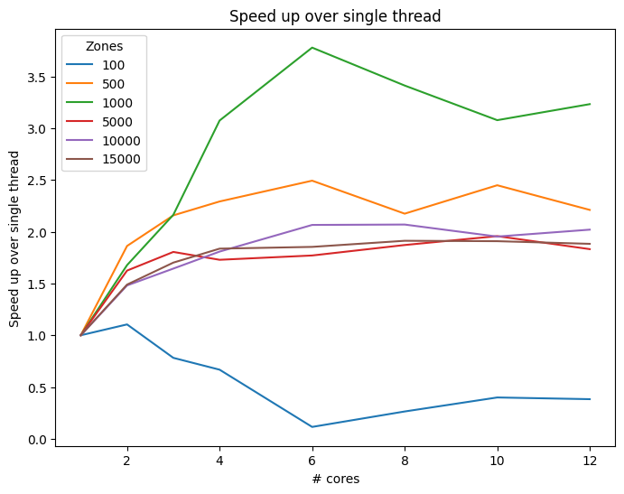
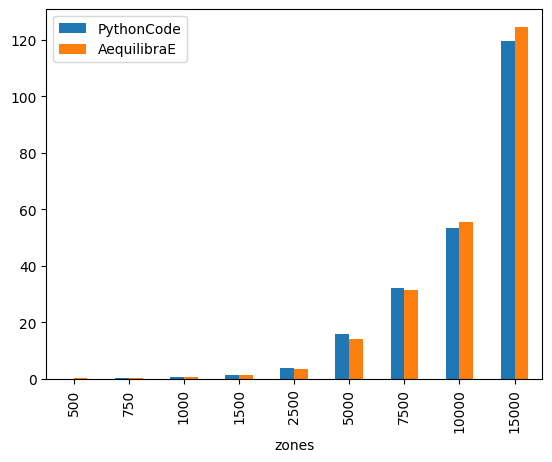

IPF Performance
===============

It is quite common to have zones with different growth rates. To improve obtaining
a trip matrix, which satisfies both trip-end constraints, we can use iterative methods,
such as the iterative proportional fitting (IPF). In this section, we compare the 
runtime of AquilibraE's current implementation of IPF, 
with a general IPF algorithm, available `here <https://github.com/joshchea/python-tdm/blob/master/scripts/CalcDistribution.py>`_.

Teh first analysis is related to the :ref:`number of cores used in IPF`. AequilibraE's
IPF allows the user to use more than one core to speed up the fitting process, which
is extremely useful when handling models with lots of traffic zones. As we can see,
instances with 100, 500 and 1.000 zones were promptly solved, but as their size incresed,
the power of multi-proceesing shows up and we can see that it barely halves the runtime.

.. image:: ../images/ipf_runtime_vs_num_cores.png
    :alt: number of cores used in IPF

:ref:`AequilibraE's runtime` is smaller when compared with the benchmark code.
From the figure below, we can notice that the runtimes were practically the same for the instance with 100 zones.
As the number of zones increases, even AequilibraE's IPF results for one core demonstrates that our
algorithm require less processing time. Its also worth mentioning that the user can set up a threshold for
AequilibraE's IPF function, as well as use more than one core to speed up the fitting process.

