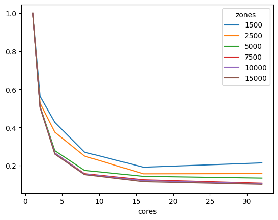

IPF Performance
===============

It is quite common to have zones with different growth rates. To improve obtaining
a trip matrix, which satisfies both trip-end constraints, we can use iterative methods,
such as the iterative proportional fitting (IPF). In this section, we compare the 
runtime of AquilibraE's current implementation of IPF, 
with a general IPF algorithm, available `here <https://github.com/joshchea/python-tdm/blob/master/scripts/CalcDistribution.py>`_.

The first analysis is related to the :ref:`number of cores used in IPF`. AequilibraE's
IPF allows the user to use more than one core to speed up the fitting process, which
is extremely useful when handling models with lots of traffic zones. As we can see,
instances with more zones benefited the most from the power of multi-processing 
speeding up the runtime in barely five times using five cores.

The figure below compares the :ref:`AequilibraE's IPF runtime` with one core with the benchmark Python
code. From the figure below, we can notice that the runtimes were practically the same for the 
instances with 1,000 zones or less. As the number of zones increases, AequilibraE demonstrated to be faster 
than the benchmark python code in instances with :math: 1,000 < zones < 10,000, but it was a 
slower than the benchmark for the larger instances with 10,000 and 15,000 zones. It's worth mentioning that 
the user can set up a threshold for AequilibraE's IPF function, as well as use more than one 
core to speed up the fitting process.

.. image:: ../images/ipf_runtime_aequilibrae_vs_benchmark.png
    :align: center
    :alt: AequilibraE's IPF runtime
